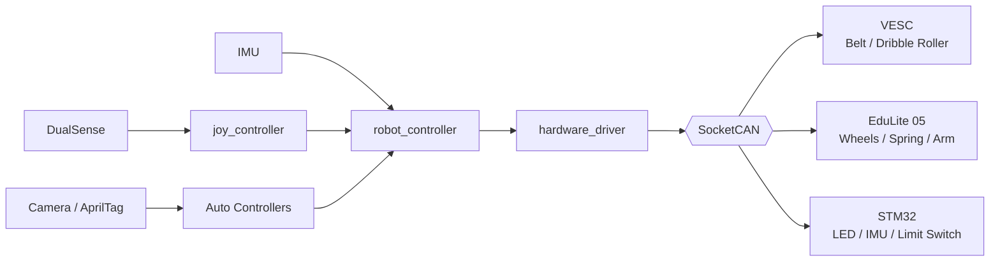

<div align="center">


### ROS 2 × CANで動く、RoDEPの競技ロボット制御システム

九州工業大学ロボットサークル **RoDEP** が開発する、ROX2026向けソフトウェアです。

[](https://docs.ros.org/en/humble/)
[](https://isocpp.org/)
[](https://www.docker.com/)
[](#-システム構成)
[](LICENSE)

**Mecanum Drive · Automatic Shooting · AprilTag Auto Aim · CAN Motor Control · LED Feedback**

[Overview](#overview) · [Architecture](#システム構成) · [Quick Start](#quick-start) · [Documentation](#documentation)

</div>

---

## Overview

ROX2026は、ゲームパッドによる手動操作から競技用の自動照準・射出までをROS 2で統合しています。機構制御とCANプロトコルを分離し、VESC、EduLite 05、STM32を共通のROSインターフェースから扱います。

| Operation | Control | Hardware | Vision |
|---|---|---|---|
| DualSense入力 | メカナム走行 | VESC | AprilTag検出 |
| 手動・競技モード | ベルト・ドリブル | EduLite 05 | Game 2自動照準 |
| 非常停止・反転操作 | Spring射出 | STM32 | Foxglove可視化 |

## システム構成



### Hardware mapping

| Device | Logical ID / CAN ID | 担当 |
|---|---|---|
| EduLite 05 | Logical ID `0–3` | 4輪メカナム |
| EduLite 05 | Logical ID `4` | Spring |
| EduLite 05 | Logical ID `5` | ドリブル姿勢 |
| VESC | Logical ID `10` | 上ベルト |
| VESC | Logical ID `11` | 下ベルト |
| VESC | Logical ID `12` | ドリブルローラー |
| STM32 | CAN `0x100–0x322` | heartbeat、LED、リミットスイッチ、IMU |

## ROS 2 Packages

| Package | 役割 |
|---|---|
| [`joy_controller`](ros2_ws/src/joy_controller/README.md) | Joy入力を走行・機構指令と運転モードへ変換 |
| [`robot_controller`](ros2_ws/src/robot_controller/README.md) | 状態遷移、軌道生成、安全処理、自動制御 |
| [`hardware_driver`](ros2_ws/src/hardware_driver/README.md) | ROSメッセージとCANフレームを相互変換 |
| [`robot_bringup`](ros2_ws/src/robot_bringup/README.md) | launch、実機パラメーター、競技モード、機構別テスト |
| `actuator_msgs` | アクチュエーター指令・状態・位置校正サービス |
| `robot_msgs` | ROX2026固有の制御・テレメトリメッセージ |
| `ros2_socketcan` | SocketCANとROS 2トピックのブリッジ |

## Quick Start

### 1. コンテナを起動

```bash
git clone <repository-url> rox2026
cd rox2026
docker compose build
docker compose up -d
docker compose exec ros2_rox2026 bash
```

### 2. ROS 2ワークスペースをビルド

```bash
source /opt/ros/humble/setup.bash
cd /root/ros2_ws
colcon build --symlink-install
source install/setup.bash
```

### 3. モードを選んで起動

```bash
# Game 1（手動操作）
ros2 launch robot_bringup manual_robot.launch.py

# Game 2 自動照準
ros2 launch robot_bringup game2_auto.launch.py

# PK 自動照準
ros2 launch robot_bringup pk_auto.launch.py

# Game 3
ros2 launch robot_bringup game3_robot.launch.py
```

## Development Commands

ROS 2環境を導入済みのホストでは、リポジトリ直下のMakefileも利用できます。

```bash
make build
make build-pkg pkg=hardware_driver
make clean-build pkg=robot_controller
make can-check
```

コンテナ内の作業ディレクトリは `/root/ros2_ws` です。実機パラメーターとCAN IDは `ros2_ws/src/robot_bringup/config/` で管理しています。

## Documentation

### Controllers

| Document | 内容 |
|---|---|
| [Mecanum Controller](docs/controllers/mecanum.md) | 逆運動学、車輪速度制限、非常停止 |
| [Spring Controller](docs/controllers/spring.md) | 原点復帰、通常発射、低速発射 |
| [Dribble Controller](docs/controllers/dribble.md) | ローラー、姿勢、Shot Cycle、ボール検出 |
| [Game 2 / PK Auto Aim](docs/controllers/game2-aim.md) | AprilTag照準、ターゲット選択、状態遷移 |

### Hardware

| Document | 内容 |
|---|---|
| [VESC Driver](docs/hardware/vesc.md) | RPM・始動電流制御、フィードバック |
| [EduLite 05 Driver](docs/hardware/edulite05.md) | Velocity、PP、CSP、位置基準 |
| [STM32 Driver](docs/hardware/stm32.md) | CANプロトコル、LED、IMU、heartbeat |

### Setup & Tools

| Document | 内容 |
|---|---|
| [YOLO Ball Detection](docs/yolo_ball_setup.md) | RDK X5向けボール検出 |
| [RDK X5 Scripts](script/README.md) | セットアップ、診断、ログ解析 |
| [Raspberry Pi 5 Forwarder](raspi_controller/RasberryPi5/README.md) | DualSense冗長転送 |
| [RDK X5 Receiver](raspi_controller/RDKX5/README.md) | DualSense冗長受信 |

## Repository Layout

```text
rox2026/
├── docs/
│   ├── controllers/       # 機構・自動制御の詳細
│   └── hardware/          # CANデバイスとdriverの詳細
├── raspi_controller/      # DualSense冗長通信
├── receiveCanConfiguration/
├── ros2_ws/
│   └── src/               # ROS 2 packages
├── script/                # セットアップ・診断・解析
├── docker-compose.yml
├── Dockerfile
└── Makefile
```

## License

Distributed under the [MIT License](LICENSE).

---

<div align="center">

**Built by RoDEP · Kyushu Institute of Technology**

</div>
