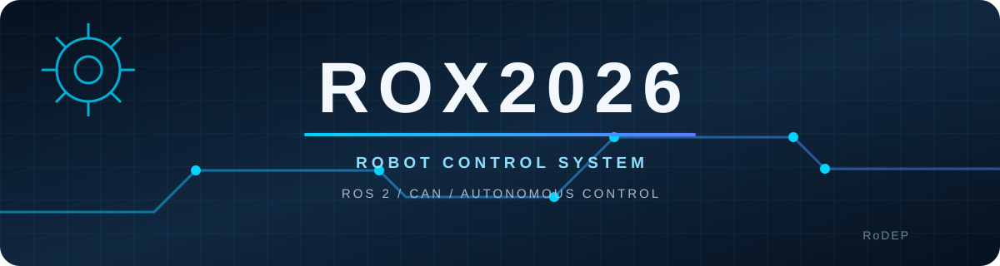
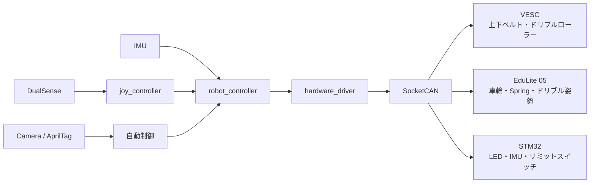

<div align="center">



九州工業大学ロボットサークル RoDEPが開発した、ROX2026競技ロボットの制御ソフトウェアです。

[](https://docs.ros.org/en/humble/)
[](https://isocpp.org/)
[](#実行環境)
[](LICENSE)

</div>

## 概要

このリポジトリには、ゲームパッドによる手動操作、メカナム走行、ボール保持・射出機構、AprilTagを使った自動照準、CANデバイスとの通信処理が含まれています。

実機ではRDK X5上のROS 2 Humbleをネイティブで使用します。VESC、EduLite 05、STM32固有のCAN処理は `hardware_driver` にまとめ、上位の制御ノードはlogical IDとROS 2メッセージで各機構を扱います。

## システム構成



### 主な機能

- DualSenseによるメカナム走行と機構操作
- IMUを利用したHeading Hold
- 上下ベルト、ドリブルローラー、ドリブル姿勢の制御
- Springの原点復帰、通常発射、低速発射
- Game 2およびPKのAprilTag自動照準
- ROS 2とVESC、EduLite 05、STM32間のCAN通信
- Foxgloveによる状態確認

### ハードウェアの割り当て

| デバイス | ID | 担当 |
|---|---:|---|
| EduLite 05 | logical ID 0–3 | 4輪メカナム |
| EduLite 05 | logical ID 4 | Spring |
| EduLite 05 | logical ID 5 | ドリブル姿勢 |
| VESC | logical ID 10 | 上ベルト |
| VESC | logical ID 11 | 下ベルト |
| VESC | logical ID 12 | ドリブルローラー |
| STM32 | CAN ID 0x100 / 0x101 | heartbeat |
| STM32 | CAN ID 0x201 | LED指令 |
| STM32 | CAN ID 0x310 | リミットスイッチ |
| STM32 | CAN ID 0x320–0x322 | IMU |

## ROS 2パッケージ

| パッケージ | 内容 |
|---|---|
| [`joy_controller`](ros2_ws/src/joy_controller/README.md) | Joy入力を走行・機構指令へ変換 |
| [`robot_controller`](ros2_ws/src/robot_controller/README.md) | 機構の状態遷移、軌道生成、自動制御 |
| [`hardware_driver`](ros2_ws/src/hardware_driver/README.md) | ROS 2メッセージとCANフレームを相互変換 |
| [`robot_bringup`](ros2_ws/src/robot_bringup/README.md) | launchファイルと実機パラメーターを管理 |
| `actuator_msgs` | アクチュエーター共通の指令・状態・サービス定義 |
| `robot_msgs` | ROX2026固有のメッセージ定義 |
| `ros2_socketcan` | SocketCANとROS 2トピックのブリッジ |

## 実行環境

ROX2026はRDK X5上でROS 2 Humbleをネイティブ実行します。DockerはPC上での開発とビルド確認にのみ使用します。

### RDK X5のセットアップ

RDK X5にはUbuntu 22.04 Desktopイメージを書き込み、初回起動後にUSBメモリから `rdk_setup.sh` だけをホームディレクトリへコピーします。ネットワークへ接続し、ROS 2 Humbleが利用できることを確認してから、セットアップスクリプトを一般ユーザーで実行します。

```bash
cd ~
chmod +x rdk_setup.sh
./rdk_setup.sh
```

`rdk_setup.sh` 自体を `sudo` で実行しないでください。必要な管理者権限はスクリプト内で要求されます。このスクリプトは、ネットワーク、SSH、Bluetooth、CAN、ROS 2依存パッケージ、Ninja、ccache、シェル環境を設定し、GitHub認証後に `main-v2` ブランチを `~/rox2026` へクローンします。実行中にWi-FiやGitHubなどの設定を対話形式で入力します。詳しい内容は[RDK X5セットアップ手順](script/rdk-x5-setup.md)を参照してください。

### ビルド

RDK X5では `ros2_ws/Makefile` をビルドの入口として使用します。`make build` は `colcon` からCMakeのNinjaジェネレーターを呼び出し、ccacheと並列ビルドを有効にします。`rdk_setup.sh` を完了していればROS 2環境と依存パッケージは設定済みです。

```bash
cd ~/rox2026/ros2_ws
make build
source install/setup.bash
```

新しい端末では、セットアップスクリプトが作成したシェル設定により、ビルド済みワークスペースが自動的に読み込まれます。ビルド設定は必要に応じて変更できます。

```bash
# ビルド時に使用するジョブ数とcolconの並列ワーカー数を指定
make build BUILD_JOBS=4 PARALLEL_WORKERS=2

# 指定したパッケージと、その依存先までビルド
make build-package PACKAGE=robot_controller

# テストを有効にしてビルドし、テストを実行
make test
```

## 起動

用途に応じて次のlaunchファイルを使用します。

```bash
# Game 1（手動操作）
ros2 launch robot_bringup manual_robot.launch.py

# Game 2自動照準
ros2 launch robot_bringup game2_auto.launch.py

# PK自動照準
ros2 launch robot_bringup pk_auto.launch.py

# Game 3（専用の操作・機構設定）
ros2 launch robot_bringup game3_robot.launch.py

```

機構別の起動方法やlaunch引数は[robot_bringupの説明](ros2_ws/src/robot_bringup/README.md)を参照してください。

## PC上の開発環境

開発用PCではDocker ComposeでROS 2 Humble環境を構築できます。このコンテナは実機運用を目的としたものではありません。

```bash
git clone git@github.com:rodep-soft/rox2026.git
cd rox2026
docker compose build
docker compose up -d
docker compose exec ros2_rox2026 bash
```

コンテナ内の作業ディレクトリは `/root/ros2_ws` です。RDK X5と同じく、ワークスペースのMakefileからNinjaビルドを実行します。

```bash
make build
source install/setup.bash
```

リポジトリ直下のMakefileには、Dockerの起動や診断で使用するショートカットもあります。ビルド設定を明示して実行する場合は、`ros2_ws` ディレクトリのMakefileを使用してください。

```bash
make build
make build-pkg pkg=hardware_driver
make clean-build pkg=robot_controller
make can-check
```

## ドキュメント

### Controller

| 資料 | 内容 |
|---|---|
| [Mecanum Controller](docs/controllers/mecanum.md) | 逆運動学、車輪速度制限、非常停止 |
| [Spring Controller](docs/controllers/spring.md) | 原点復帰、通常発射、低速発射 |
| [Dribble Controller](docs/controllers/dribble.md) | ローラー、姿勢、Shot Cycle、ボール検出 |
| [Game 2 / PK Auto Aim](docs/controllers/game2-aim.md) | AprilTag照準、ターゲット選択、状態遷移 |

### Hardware

| 資料 | 内容 |
|---|---|
| [VESC Driver](docs/hardware/vesc.md) | RPM制御、始動電流制御、フィードバック |
| [EduLite 05 Driver](docs/hardware/edulite05.md) | Velocity、PP、CSP、位置基準 |
| [STM32 Driver](docs/hardware/stm32.md) | CANプロトコル、LED、IMU、heartbeat |

### セットアップと補助ツール

| 資料 | 内容 |
|---|---|
| [YOLOボール検出](docs/yolo_ball_setup.md) | RDK X5向けボール検出の導入 |
| [スクリプト一覧](script/README.md) | RDK X5セットアップ、診断、ログ解析 |
| [Raspberry Pi 5 Forwarder](raspi_controller/RasberryPi5/README.md) | DualSense入力の冗長転送 |
| [RDK X5 Receiver](raspi_controller/RDKX5/README.md) | DualSense入力の冗長受信 |

## ディレクトリ構成

```text
rox2026/
├── docs/                       詳細資料
│   ├── controllers/            機構・自動制御
│   └── hardware/               CANデバイスとdriver
├── raspi_controller/           DualSense冗長通信
├── receiveCanConfiguration/    STM32 firmware
├── ros2_ws/src/                ROS 2パッケージ
├── script/                     セットアップ・診断・解析
├── docker-compose.yml
├── Dockerfile
└── Makefile
```

## ライセンス

このリポジトリは[MIT License](LICENSE)で公開されています。
