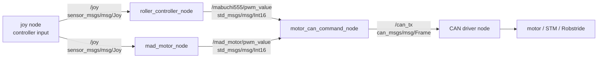
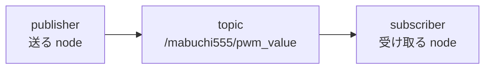
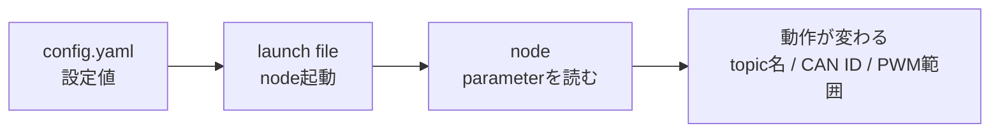
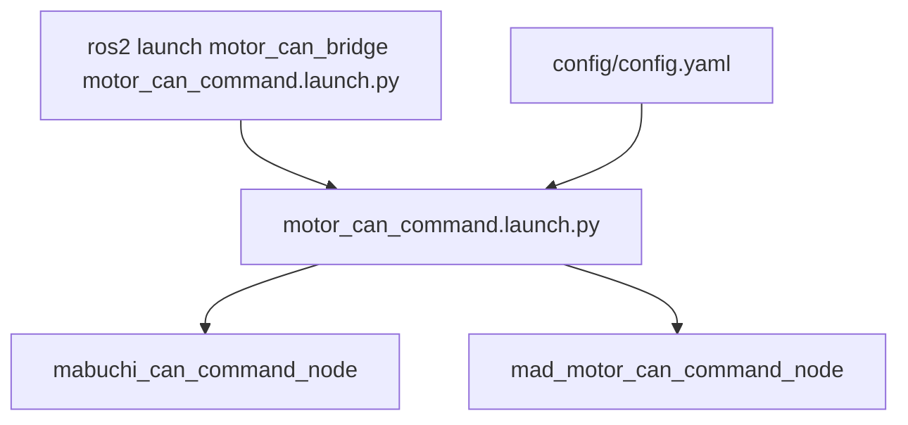

# ROS 2 Workspace Guide

この README は、この workspace を触るときに必要になる ROS 2 の基本用語をまとめたもの。

実装ごとの詳しい接続関係は [src/README.md](src/README.md) を参照。

## ROS 2 の全体像

ROS 2 では、処理を小さな `node` に分け、node 同士を `topic` や `service` でつなぐ。

この workspace のモータ制御では、主に `node`、`topic`、`message`、`parameter`、`launch` を使っている。



## node とは

`node` は ROS 2 で動く 1 つのプログラム。

この workspace の例:

- `roller_controller_node`: `/joy` を読んでローラー用 PWM を作る
- `mad_motor_node`: `/joy` を読んで MAD motor 用 PWM を作る
- `motor_can_command_node`: PWM を CAN frame に変換する
- `robstride_velocity_node`: SocketCAN へ直接 write して Robstride を動かす

node は C++ では `rclcpp::Node` を継承して作る。

```cpp
class MotorCanCommandNode : public rclcpp::Node
{
public:
  MotorCanCommandNode();
};
```

起動中の node を見る。

```bash
ros2 node list
```

node の情報を見る。

```bash
ros2 node info /motor_can_command_node
```

## topic とは

`topic` は node 同士が message を流すための名前付きの通り道。

送る側を `publisher`、受け取る側を `subscriber` と呼ぶ。



この workspace の例:

- `/joy`: コントローラ入力
- `/mabuchi555/pwm_value`: Mabuchi 用 PWM
- `/mad_motor/pwm_value`: MAD motor 用 PWM
- `/can_tx`: CAN 送信用 frame
- `/joint_states`: joint の位置、速度、トルク

topic 一覧を見る。

```bash
ros2 topic list
```

topic に流れている値を見る。

```bash
ros2 topic echo /mabuchi555/pwm_value
```

topic の型を見る。

```bash
ros2 topic info /mabuchi555/pwm_value
```

topic に手で message を送る。

```bash
ros2 topic pub --once /mabuchi555/pwm_value std_msgs/msg/Int16 "{data: 100}"
```

## message とは

`message` は topic に流れるデータの型。

同じ topic で通信する publisher と subscriber は、同じ message 型を使う必要がある。

この workspace の例:

- `std_msgs/msg/Int16`: PWM 値など、16 bit 整数 1 個
- `sensor_msgs/msg/Joy`: コントローラのボタンやスティック入力
- `can_msgs/msg/Frame`: CAN frame
- `sensor_msgs/msg/JointState`: joint の状態

message 型の中身を見る。

```bash
ros2 interface show std_msgs/msg/Int16
ros2 interface show can_msgs/msg/Frame
```

`std_msgs/msg/Int16` は中身が `data` だけなので、publish するときはこう書く。

```bash
ros2 topic pub --once /mad_motor/pwm_value std_msgs/msg/Int16 "{data: 120}"
```

## parameter とは

`parameter` は node の設定値。

ソースコードを変えなくても、topic 名、CAN ID、PWM の範囲、周期などを launch file や yaml から変えられる。



`motor_can_bridge/config/config.yaml` の例:

```yaml
mabuchi_can_command_node:
  ros__parameters:
    pwm_topic: "/mabuchi555/pwm_value"
    can_tx_topic: "/can_tx"
    can_id: 0x201
    min_pwm: -255
    max_pwm: 255
    send_period_ms: 20
    timeout_ms: 500
```

起動中 node の parameter を見る。

```bash
ros2 param list /mabuchi_can_command_node
ros2 param get /mabuchi_can_command_node can_id
```

parameter を一時的に変更する。

```bash
ros2 param set /mabuchi_can_command_node timeout_ms 1000
```

ただし、node 側が実行中の parameter 変更に対応していない場合、変更してもすぐ動作に反映されないことがある。

## launch とは

`launch` は複数の node をまとめて起動する仕組み。

毎回 `ros2 run ...` を何個も打つ代わりに、launch file に node 名、実行ファイル、parameter yaml などを書いておく。



例:

```bash
ros2 launch motor_can_bridge motor_can_command.launch.py
```

config を指定して起動する。

```bash
ros2 launch motor_can_bridge motor_can_command.launch.py config_file:=/path/to/config.yaml
```

## package とは

`package` は ROS 2 のビルド単位。

この workspace の `src/` 以下には、複数の package がある。

- `roller_controller`
- `mad_motor`
- `motor_can_bridge`
- `robstride_can`

package には主に次のファイルがある。

- `package.xml`: 依存 package などのメタ情報
- `CMakeLists.txt`: ビルド方法
- `src/`: C++ の実装
- `include/`: C++ の header
- `config/`: parameter yaml
- `launch/`: launch file

## build と source

コードを変更したら、workspace root で build する。

```bash
colcon build
```

build 後は、現在の shell に install された package を読み込ませる。

```bash
source install/setup.bash
```

特定 package だけ build する。

```bash
colcon build --packages-select motor_can_bridge
source install/setup.bash
```

## よく使う確認コマンド

```bash
# node
ros2 node list
ros2 node info /node_name

# topic
ros2 topic list
ros2 topic echo /topic_name
ros2 topic info /topic_name

# message
ros2 interface show std_msgs/msg/Int16

# parameter
ros2 param list /node_name
ros2 param get /node_name parameter_name

# package
ros2 pkg list
ros2 pkg prefix motor_can_bridge
```

## この workspace での読み方

まず ROS 2 の構造を知りたいとき:

1. この README で `node`、`topic`、`message`、`parameter`、`launch` の意味を見る
2. [src/README.md](src/README.md) でモータ制御 node 同士の接続を見る
3. 各 package の README で具体的な topic、parameter、起動方法を見る

package ごとの README:

- [roller_controller](src/roller_controller/README.md)
- [mad_motor](src/mad_motor/README.md)
- [motor_can_bridge](src/motor_can_bridge/README.md)
- [robstride_can](src/robstride_can/README.md)
