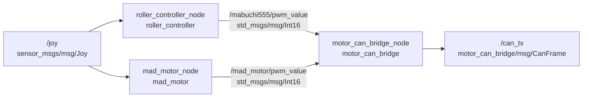
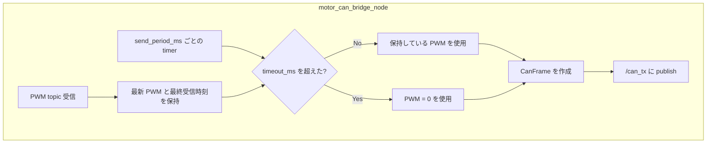
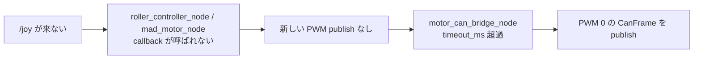

# Motor Control Nodes

このワークスペース内の次の 3 ノードについて、現在の実装上の接続関係と動作をまとめる。

- `roller_controller_node`
- `mad_motor_node`
- `motor_can_bridge_node`

## ノード間の流れ



`roller_controller_node` と `mad_motor_node` は `/joy` を受け取り、それぞれ PWM 値を publish する。

`motor_can_bridge_node` はその PWM 値を受け取り、CAN 送信用の `CanFrame` に詰め替えて `/can_tx` に publish する。

## roller_controller_node

ディレクトリ: `roller_controller`

ローラー用の PWM 指令を作るノード。

### Subscribe

- `/joy` (`sensor_msgs/msg/Joy`)

### Publish

- `/mabuchi555/pwm_value` (`std_msgs/msg/Int16`)

### 現在の動作

起動直後は `Stop`。

`/joy` を受信したとき、`enable_button` と方向ボタンが同時に押されている場合だけ、保持しているモードと PWM 値を更新する。

- `enable_button + positive_button`: 正回転
- `enable_button + negative_button`: 逆回転
- `enable_button + stop_button`: 停止

新しい更新入力がない `/joy` を受信した場合は、前回保持している PWM 値を publish する。

`/joy` 自体を受信していない間は callback が呼ばれないため、このノードから新しい PWM は publish されない。

## mad_motor_node

ディレクトリ: `mad_motor`

MAD モータ用の PWM 指令を作るノード。

### Subscribe

- `/joy` (`sensor_msgs/msg/Joy`)

### Publish

- `/mad_motor/pwm_value` (`std_msgs/msg/Int16`)

### 現在の動作

起動直後は `Stop`。

`/joy` を受信したとき、`enable_button` とモードボタンが同時に押されている場合だけ、保持しているモードと PWM 値を更新する。

- `enable_button + stop_button`: 停止
- `enable_button + circle_button`: `Angle1High`
- `enable_button + cross_button`: `Angle1Low`
- `enable_button + triangle_button`: `Angle2JHigh`
- `enable_button + square_button`: `Angle2Low`

新しい更新入力がない `/joy` を受信した場合は、前回保持している PWM 値を publish する。

`/joy` 自体を受信していない間は callback が呼ばれないため、このノードから新しい PWM は publish されない。

## motor_can_bridge_node

ディレクトリ: `motor_can_bridge`

PWM topic を CAN frame に変換するノード。

### Subscribe

- `/mabuchi555/pwm_value` (`std_msgs/msg/Int16`)
- `/mad_motor/pwm_value` (`std_msgs/msg/Int16`)

### Publish

- `/can_tx` (`motor_can_bridge/msg/CanFrame`)

### 現在の動作

起動直後の Mabuchi PWM と MAD motor PWM はどちらも `0`。

各 PWM topic を受信すると、最新の PWM 値と最終受信時刻を保持する。

`send_period_ms` ごとの timer で、Mabuchi 用と MAD motor 用の CAN frame をそれぞれ publish する。

各 PWM topic の最終受信時刻から `timeout_ms` を超えている場合、その系統の PWM は `0` として CAN frame を作る。



## CAN frame の payload

`motor_can_bridge_node` が publish する payload は現在 8 byte。

```text
data[0] = 0x00
data[1] = PWM lower byte
data[2] = PWM upper byte
data[3] = 0x00
data[4] = 0x00
data[5] = 0x00
data[6] = 0x00
data[7] = 0x00
```

PWM は `int16` の little-endian として `data[1]` と `data[2]` に入る。

## topic が来ない場合の現在の扱い



現在の実装では、`roller_controller_node` と `mad_motor_node` は `/joy` callback 内で publish する。

そのため `/joy` 自体が来ていない間は、これら 2 ノードから新しい PWM は publish されない。

下流の `motor_can_bridge_node` は各 PWM topic の最終受信時刻を見ており、`timeout_ms` を超えた系統は PWM `0` として `/can_tx` に publish する。
