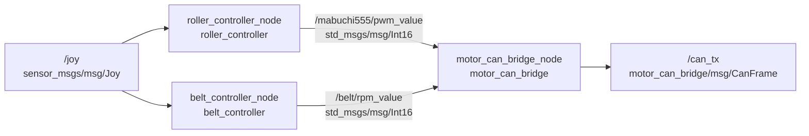
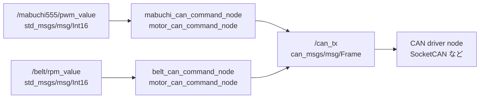
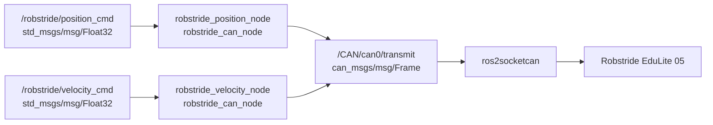
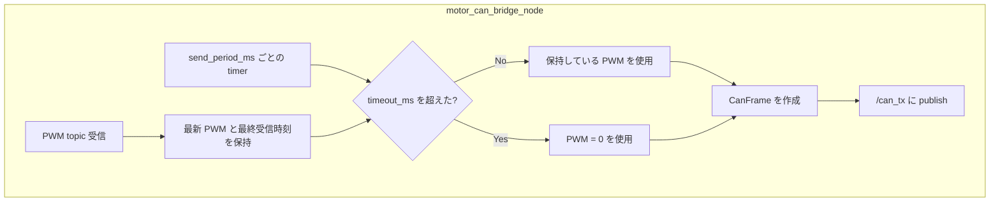
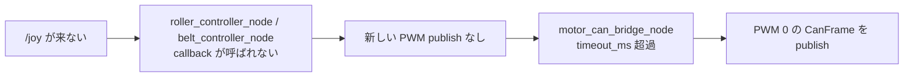

# Motor Control Nodes

このワークスペース内のモータ制御まわりについて、現在の実装上の接続関係と動作をまとめる。

ROS 2 の `node`、`topic`、`message`、`parameter`、`launch` の基本は [../README.md](../README.md) を参照。

- `roller_controller_node`
- `belt_controller_node`
- `motor_can_bridge_node`
- `motor_can_command_node`
- `robstride_velocity_node`

`roller_controller_node`、`belt_controller_node`、`motor_can_bridge_node` は STM 向けの PWM CAN bridge 系。
`robstride_velocity_node` は Robstride EduLite 05 向けで、SocketCAN へ直接 write する別系統の node。

## ノード間の流れ

### STM 向け PWM bridge



`roller_controller_node` と `belt_controller_node` は `/joy` を受け取り、それぞれ PWM 値を publish する。

`motor_can_bridge_node` はその PWM 値を受け取り、CAN 送信用の `CanFrame` に詰め替えて `/can_tx` に publish する。

### can_msgs 向け command node



`motor_can_command_node` は 1 つの PWM topic を 1 つの CAN ID の `can_msgs/msg/Frame` に変換する汎用 node。
同じ executable を parameter 違いで複数起動することで、roller 用と belt 用を分けて使える。

### Robstride 向け CAN frame node



`robstride_can_node` は Robstride の Private Protocol を `can_msgs/msg/Frame` として publish する。
実際の SocketCAN 送信は `ros2socketcan` が担当する。

## roller_controller_node

ディレクトリ: `roller_controller`

ローラー用の PWM 指令を作るノード。

### Subscribe

- `/joy` (`sensor_msgs/msg/Joy`)

### Publish

- `/mabuchi555/pwm_value` (`std_msgs/msg/Int16`)

### 現在の動作

起動直後は `Stop`。

`/joy` を受信したとき、`enable_button` と方向ボタンが同時に押されている場合だけ、保持しているモードと PWM 値を更新する。

- `enable_button + positive_button`: 正回転
- `enable_button + negative_button`: 逆回転
- `enable_button + stop_button`: 停止

新しい更新入力がない `/joy` を受信した場合は、前回保持している PWM 値を publish する。

`/joy` 自体を受信していない間は callback が呼ばれないため、このノードから新しい PWM は publish されない。

## belt_controller_node

ディレクトリ: `belt_controller`

belt 用モータの PWM 指令を作るノード。

### Subscribe

- `/joy` (`sensor_msgs/msg/Joy`)

### Publish

- `/belt/rpm_value` (`std_msgs/msg/Int16`)

### 現在の動作

起動直後は `Stop`。

`/joy` を受信したとき、`enable_button` とモードボタンが同時に押されている場合だけ、保持しているモードと PWM 値を更新する。

- `enable_button + stop_button`: 停止
- `enable_button + circle_button`: `Angle1High`
- `enable_button + cross_button`: `Angle1Low`
- `enable_button + triangle_button`: `Angle2JHigh`
- `enable_button + square_button`: `Angle2Low`

新しい更新入力がない `/joy` を受信した場合は、前回保持している PWM 値を publish する。

`/joy` 自体を受信していない間は callback が呼ばれないため、このノードから新しい PWM は publish されない。

## motor_can_bridge_node

ディレクトリ: `motor_can_bridge`

2 つの PWM topic を独自 message の CAN frame に変換するノード。

### Subscribe

- `/mabuchi555/pwm_value` (`std_msgs/msg/Int16`)
- `/belt/rpm_value` (`std_msgs/msg/Int16`)

### Publish

- `/can_tx` (`motor_can_bridge/msg/CanFrame`)

### 現在の動作

起動直後の roller PWM と belt PWM はどちらも `0`。

各 PWM topic を受信すると、最新の PWM 値と最終受信時刻を保持する。

`send_period_ms` ごとの timer で、roller 用と belt 用の CAN frame をそれぞれ publish する。

各 PWM topic の最終受信時刻から `timeout_ms` を超えている場合、その系統の PWM は `0` として CAN frame を作る。



## CAN frame の payload

`motor_can_bridge_node` が publish する payload は現在 8 byte。

```text
data[0] = 0x00
data[1] = PWM lower byte
data[2] = PWM upper byte
data[3] = 0x00
data[4] = 0x00
data[5] = 0x00
data[6] = 0x00
data[7] = 0x00
```

PWM は `int16` の little-endian として `data[1]` と `data[2]` に入る。

## motor_can_command_node

ディレクトリ: `motor_can_bridge`

1 つの PWM topic を `can_msgs/msg/Frame` に変換するノード。

`motor_can_bridge_node` が package 独自の `motor_can_bridge/msg/CanFrame` を出すのに対して、こちらは一般的な CAN driver node が扱いやすい `can_msgs/msg/Frame` を publish する。

### Subscribe

- parameter `pwm_topic` で指定した topic (`std_msgs/msg/Int16`)

### Publish

- parameter `can_tx_topic` で指定した topic (`can_msgs/msg/Frame`)

### 現在の動作

起動直後の PWM は `0`。

PWM topic を受信すると、parameter `min_pwm` から `max_pwm` の範囲に丸めた最新 PWM 値と最終受信時刻を保持する。

`send_period_ms` ごとの timer で、最新 PWM を `can_msgs/msg/Frame` に詰めて publish する。

PWM topic の最終受信時刻から `timeout_ms` を超えている場合、PWM は `0` として CAN frame を作る。

### 起動

この package 内の launch file は削除済み。複数 node の起動構成は `robot_bringup` 側に集約する。

### CAN frame の payload

`motor_can_command_node` が publish する payload は 8 byte。

```text
data[0] = PWM lower byte
data[1] = PWM upper byte
data[2] = 0x00
data[3] = 0x00
data[4] = 0x00
data[5] = 0x00
data[6] = 0x00
data[7] = 0x00
```

PWM は `int16` の little-endian として `data[0]` と `data[1]` に入る。

## robstride_can_node

ディレクトリ: `robstride_can_node`

Robstride EduLite 05 を Private Protocol で位置制御または速度制御するノード。

この node は SocketCAN interface を直接 open しない。`/CAN/can0/transmit` に `can_msgs/msg/Frame` を publish し、`ros2socketcan` 経由で実 CAN bus へ送る。

### Subscribe

- `/robstride/position_cmd` (`std_msgs/msg/Float32`)
- `/robstride/velocity_cmd` (`std_msgs/msg/Float32`)

### Publish

- `/CAN/can0/transmit` (`can_msgs/msg/Frame`)

### 起動

この package 内の launch file は削除済み。位置制御用/速度制御用の起動構成は `robot_bringup` 側に集約する。

位置制御または速度制御の指令を `Float32` で送る。

```bash
ros2 topic pub /robstride/position_cmd std_msgs/msg/Float32 "{data: 1.0}" -1
ros2 topic pub /robstride/velocity_cmd std_msgs/msg/Float32 "{data: 0.5}" -1
```

## topic が来ない場合の現在の扱い



現在の実装では、`roller_controller_node` と `belt_controller_node` は `/joy` callback 内で publish する。

そのため `/joy` 自体が来ていない間は、これら 2 ノードから新しい PWM は publish されない。

下流の `motor_can_bridge_node` は各 PWM topic の最終受信時刻を見ており、`timeout_ms` を超えた系統は PWM `0` として `/can_tx` に publish する。
