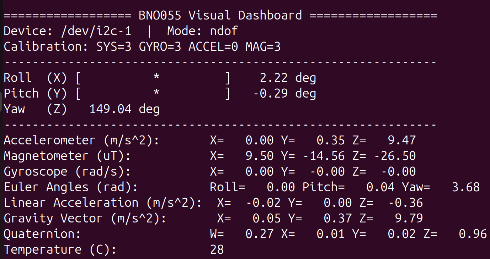
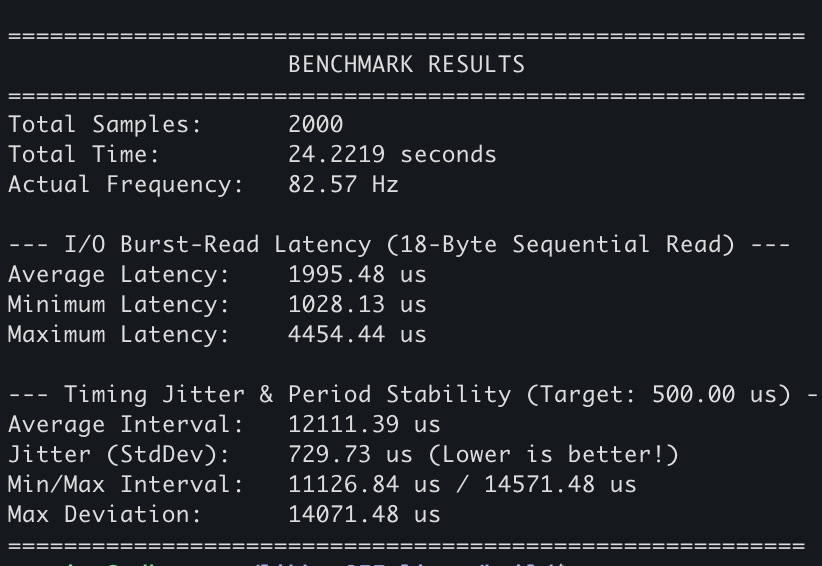

# libbno055-linux

[](https://github.com/lazytatzv/libbno055-linux/actions)
[](LICENSE)
[](https://en.cppreference.com/w/cpp/17)
[](https://docs.ros.org/)
[](CHANGELOG.md)

A C++17 driver for the Bosch BNO055 9-axis IMU on Linux, with first-class ROS 2 integration.



---

## Components

| Component | Description |
| :--- | :--- |
| **Hardware Driver** | C++17 I2C/UART driver for the BNO055. Handles initialization, sensor reads, calibration, and transport recovery. |
| **ROS 2 Package** | Composable and Lifecycle nodes publishing `sensor_msgs/Imu`, `sensor_msgs/MagneticField`, and diagnostics. |
| **Python Bindings** | `pip install libbno055-linux` → `import libbno055` |
| **Rust Crate** | `cargo add libbno055` |
| **C API** | Stable C99 FFI interface (`bno055_c.h`) |
| **Heading Controller** | Optional PID-based straight-line correction for differential-drive robots. See [docs/HEADING_CONTROL.md](docs/HEADING_CONTROL.md). |

---

## Quick Start

### ROS 2 — IMU Driver Node

```bash
ros2 launch libbno055_linux bno055_launch.py
```

Published topics:
- `/imu/data` — `sensor_msgs/Imu` (quaternion, angular velocity, linear acceleration)
- `/imu/mag` — `sensor_msgs/MagneticField`
- `/diagnostics` — `diagnostic_msgs/DiagnosticArray`

For Nav2 Lifecycle Manager:
```bash
ros2 launch libbno055_linux bno055_launch.py node_type:=lifecycle
```

### C++17

```cpp
#include "libbno055-linux/bno055.hpp"

bno055lib::BNO055 imu(0x28, "/dev/i2c-1");
imu.begin(bno055lib::OpMode::NDOF);

auto quat = imu.getQuaternionNoexcept();
if (quat) {
    // quat->w, quat->x, quat->y, quat->z
}
```

### Python

> **Note**: The pip package name and the Python module name differ.
> Install: `pip install libbno055-linux` — Import: `import libbno055`

```bash
pip install libbno055-linux
```

```python
import libbno055
imu = libbno055.BNO055(address=0x28, device="/dev/i2c-1")
imu.begin(libbno055.OpMode.NDOF)
q = imu.get_quaternion()
```

### Rust

```bash
cargo add libbno055
```

---

## Driver Features

### Hardware Driver (C++17)

- **I2C and UART** transport backends with POSIX drivers
- **Automatic transport recovery** on bus errors and communication failures
- **18-byte sequential burst read** for Accel + Mag + Gyro in a single transaction
- **Stale Data Deduplication Filter** — eliminates duplicate frame publishing in ROS 2
- **Configurable sensor output data rates** in AMG mode (up to Accel 1 kHz / Gyro 2 kHz ODR)
- **Optional background polling thread** for continuous non-blocking reads
- **Calibration management** — save and load sensor offsets to/from file

---

### Empirical Benchmark (RDK X5 Hardware Validation)

Tested out-of-the-box on **RDK X5 (Sunrise RDK)** via standard Linux `/dev/i2c-5` interface with **zero tuning or custom OS setup**:



| Metric | Measured Value | Target / Hardware Limit | Note |
| :--- | :---: | :---: | :--- |
| **NDOF Sampling Rate** | **82.57 Hz** | 100 Hz (Hardware Limit) | ~83% of physical Cortex-M0 fusion limit |
| **I/O Burst Read Latency** | **1.99 ms** | < 5.0 ms | 18-byte sequential burst read over default I2C |
| **Timing Jitter (StdDev)** | **0.73 ms** | < 1.0 ms | Sub-millisecond interval jitter out-of-the-box |

For the full API including GPIO interrupts, axis remapping, power modes, and operating modes, see [docs/API_REFERENCE.md](docs/API_REFERENCE.md).

### ROS 2 Package

- **Composable Component** (`rclcpp_components`) — zero-copy intra-process transport
- **Managed Lifecycle Node** (`rclcpp_lifecycle`) — Nav2 Lifecycle Manager integration
- **Isolated CallbackGroups** — sensor publishing isolated from diagnostics and services
- **MultiThreadedExecutor** — parallel callback execution
- **Linux `SCHED_FIFO`** support — optional real-time thread priority
- **Dynamic Parameters** — update parameters at runtime via `ros2 param set`

---

## Installation

### Option A: apt (ROS 2 binary)

```bash
sudo apt update
sudo apt install ros-$ROS_DISTRO-libbno055-linux
```

> The `apt` binary is updated periodically by ROS Buildfarm. For the latest release (v1.10.0), build from source.

### Option B: vcstool (recommended for team/production workspaces)

Add this package to your robot's `.repos` file:

```yaml
# robot.repos
repositories:
  libbno055-linux:
    type: git
    url: https://github.com/lazytatzv/libbno055-linux.git
    version: v1.10.0
```

Then import and build:

```bash
cd ~/ros2_ws
vcs import src < robot.repos
rosdep install --from-paths src --ignore-src -r -y
colcon build
source install/setup.bash
```

To update to a new version, change `version:` in the `.repos` file and run `vcs import src < robot.repos` again.

### Option C: colcon (ROS 2 source build)

```bash
cd ~/ros2_ws/src
git clone https://github.com/lazytatzv/libbno055-linux.git
cd ~/ros2_ws
rosdep install --from-paths src --ignore-src -r -y
colcon build --packages-select libbno055_linux
source install/setup.bash
```

### Option D: CMake (standalone C++ library)

```bash
git clone https://github.com/lazytatzv/libbno055-linux.git
cd libbno055-linux
mkdir build && cd build
cmake ..
make -j$(nproc)
sudo make install
```

---

## ROS 2 Parameters

Key parameters (see [`config/bno055_params.yaml`](config/bno055_params.yaml) for the full list):

| Parameter | Default | Description |
| :--- | :---: | :--- |
| `device` | `/dev/i2c-1` | I2C device path |
| `address` | `0x28` | I2C slave address |
| `publish_rate_hz` | `100` | Sensor publish rate (Hz) |
| `frame_id` | `imu_link` | ROS TF frame ID |
| `imu_offset_x` | `0.0` | Forward physical offset from robot center of mass (m) for Lever Arm / TF |
| `imu_offset_y` | `0.0` | Leftward physical offset from robot center of mass (m) for Lever Arm / TF |
| `imu_offset_z` | `0.0` | Upward physical offset from robot center of mass (m) for Lever Arm / TF |
| ... | | |

---

## Documentation

- [API Reference — C++ / C / Python / Rust](docs/API_REFERENCE.md)
- [ROS 2 Node Architecture](src/ros2/README.md)
- [Hardware Calibration Guide](docs/CALIBRATION.md)
- [Integration Guide (EKF, Nav2, robot_localization)](docs/INTEGRATION.md)
- [Heading PID Controller (Optional)](docs/HEADING_CONTROL.md)
- [Troubleshooting & FAQ](docs/TROUBLESHOOTING.md)

---

## License

[MIT License](LICENSE)
