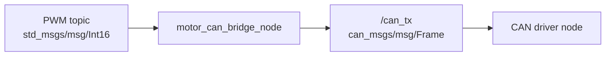

# motor_can_bridge

## 概要

`motor_can_bridge_node` は、1つのPWM topicを1つのCAN IDの
`can_msgs/msg/Frame` に変換するnode。

同じ executable をparameter違いで複数起動できる。現在のlaunch fileでは、
Mabuchi用とMAD motor用を別node名で起動する。



このnodeはCAN busへ直接送信しない。出力topicをCAN driver nodeがsubscribeして、
実際のCAN busへ送る想定。

## 入出力

### Subscribe

- parameter `pwm_topic` で指定したtopic (`std_msgs/msg/Int16`)

### Publish

- parameter `can_tx_topic` で指定したtopic (`can_msgs/msg/Frame`)

## 現在の動作

起動直後のPWMは `0`。

PWM topicを受信したとき、parameter `min_pwm` から `max_pwm` の範囲に丸めた
最新値と最終受信時刻を保持する。

timerにより `send_period_ms` ごとに、最新PWM値をCAN frameに変換してpublishする。

PWM topicの最終受信時刻から `timeout_ms` を超えている場合、PWMは `0` として
CAN frameを作る。

## CAN frame

publishするmessage型は `can_msgs/msg/Frame`。

payloadは8byte。

- `data[0]`: PWMの下位byte
- `data[1]`: PWMの上位byte
- `data[2]` から `data[7]`: `0x00`

PWMは `int16` のlittle-endianとして格納する。

CAN IDとextended frameかどうかはparameterから取得する。

- `can_id`
- `is_extended`

## 起動

Mabuchi用とMAD motor用を両方起動する。

```bash
ros2 launch motor_can_bridge motor_can_bridge.launch.py
```

Mabuchi用だけ起動する。

```bash
ros2 launch motor_can_bridge mabuchi_can_bridge.launch.py
```

MAD motor用だけ起動する。

```bash
ros2 launch motor_can_bridge mad_motor_can_bridge.launch.py
```

## パラメータ

`config/config.yaml` でnode名ごとに設定する。

- `pwm_topic`
- `can_tx_topic`
- `can_id`
- `is_extended`
- `min_pwm`
- `max_pwm`
- `send_period_ms`
- `timeout_ms`
