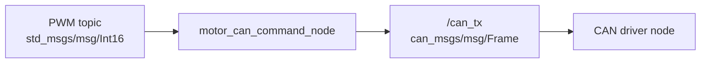

# motor_can_bridge

## 概要

`motor_can_bridge` package には、PWM topic を CAN frame に変換する node が 2 種類ある。

- `motor_can_bridge_node`: 2 つの PWM topic を package 独自の `motor_can_bridge/msg/CanFrame` に変換する
- `motor_can_command_node`: 1 つの PWM topic を標準的な `can_msgs/msg/Frame` に変換する

どちらも CAN bus へ直接送信しない。出力 topic を CAN driver node が subscribe して、実際の CAN bus へ送る想定。

## motor_can_bridge_node

### 入出力

### Subscribe

- `/mabuchi555/pwm_value` (`std_msgs/msg/Int16`)
- `/mad_motor/pwm_value` (`std_msgs/msg/Int16`)

topic 名はパラメータで変更できる。

### Publish

- `/can_tx` (`motor_can_bridge/msg/CanFrame`)

### 現在の動作

起動直後の Mabuchi PWM と MAD motor PWM はどちらも `0`。

各 PWM topic を受信したとき、最新値と最終受信時刻を保持する。

- Mabuchi PWM は `-255` から `255` の範囲に丸める
- MAD motor PWM は `0` から `255` の範囲に丸める

timer により `send_period_ms` ごとに、Mabuchi 用と MAD motor 用の CAN frame をそれぞれ publish する。

各 PWM topic の最終受信時刻から `timeout_ms` を超えている場合、その系統の PWM は `0` として CAN frame を作る。

### CAN frame

publish する message 型は `motor_can_bridge/msg/CanFrame`。

現在の payload は 8 byte。

- `data[0]`: `0x00`
- `data[1]`: PWM の下位 byte
- `data[2]`: PWM の上位 byte
- `data[3]` から `data[7]`: `0x00`

PWM は `int16` の little-endian として格納する。

CAN ID はパラメータから取得する。

- `mabuchi_can_id`
- `mad_motor_can_id`

### パラメータ

`config/config.yaml` で設定する。

- `mabuchi_pwm_topic`
- `mad_motor_pwm_topic`
- `can_tx_topic`
- `mabuchi_can_id`
- `mad_motor_can_id`
- `send_period_ms`
- `timeout_ms`

## motor_can_command_node

`motor_can_command_node` は、1 つの PWM topic を 1 つの CAN ID の `can_msgs/msg/Frame` に変換する node。

同じ executable を parameter 違いで複数起動できる。現在の launch file では、Mabuchi 用と MAD motor 用を別 node 名で起動する。



### 入出力

### Subscribe

- parameter `pwm_topic` で指定した topic (`std_msgs/msg/Int16`)

### Publish

- parameter `can_tx_topic` で指定した topic (`can_msgs/msg/Frame`)

### 現在の動作

起動直後の PWM は `0`。

PWM topic を受信したとき、parameter `min_pwm` から `max_pwm` の範囲に丸めた最新値と最終受信時刻を保持する。

timer により `send_period_ms` ごとに、最新 PWM 値を CAN frame に変換して publish する。

PWM topic の最終受信時刻から `timeout_ms` を超えている場合、PWM は `0` として CAN frame を作る。

### CAN frame

publish する message 型は `can_msgs/msg/Frame`。

payload は 8 byte。

- `data[0]`: PWM の下位 byte
- `data[1]`: PWM の上位 byte
- `data[2]` から `data[7]`: `0x00`

PWM は `int16` の little-endian として格納する。

CAN ID と extended frame かどうかは parameter から取得する。

- `can_id`
- `is_extended`

### 起動

Mabuchi 用と MAD motor 用を両方起動する。

```bash
ros2 launch motor_can_bridge motor_can_command.launch.py
```

Mabuchi 用だけ起動する。

```bash
ros2 launch motor_can_bridge mabuchi_can_command.launch.py
```

MAD motor 用だけ起動する。

```bash
ros2 launch motor_can_bridge mad_motor_can_command.launch.py
```

### パラメータ

`config/config.yaml` で node 名ごとに設定する。

- `pwm_topic`
- `can_tx_topic`
- `can_id`
- `is_extended`
- `min_pwm`
- `max_pwm`
- `send_period_ms`
- `timeout_ms`
