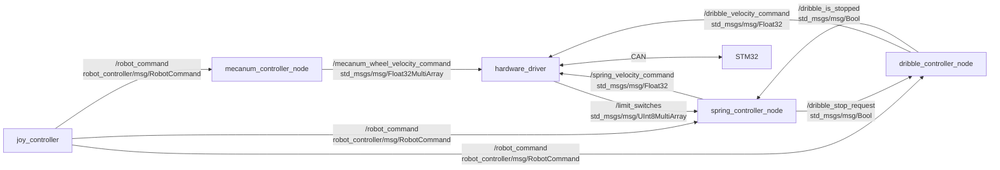

# robot_controller

`joy_controller`から受け取った機構として意味のある操作指令を、各機構の制御判断に変換するパッケージです。CANフレームの組み立てや送受信は行わず、hardware_driverへROS topicとして指令をpublishします。

## Node・topic構成

`robot_controller`は機構として意味のある速度指令だけをpublishします。CAN ID、8 byteフレーム、エンディアン、STM32との通信仕様は`hardware_driver`が担当します。

## カスタムメッセージ: `RobotCommand`

`robot_controller/msg/RobotCommand`は、`joy_controller`が`/robot_command`へpublishする操作指令です。各controller nodeは、必要なフィールドだけを使用します。

| フィールド | 型 | 用途 | 利用node |
| --- | --- | --- | --- |
| `is_intake` | `bool` | 吸気機構の操作状態 | 今後の吸気controller |
| `spring_is_fire` | `bool` | ばね射出の操作状態 | `spring_controller_node` |
| `belt_is_fire` | `bool` | ベルト射出の操作状態 | 今後のベルトcontroller |
| `belt_mode` | `uint8` | ベルトの動作モード | 今後のベルトcontroller |
| `dribble_mode` | `uint8` | ドリブルの動作モード | 今後のドリブルcontroller |
| `cmd_vel` | `geometry_msgs/Twist` | 機体の並進・角速度指令 | `mecanum_controller_node` |

`spring_controller_node`は、引き切り済みの`READY`状態で受けた`spring_is_fire`の`false → true`だけを発射要求として扱います。

## `mecanum_controller_node`

- node名: `mecanum_controller_node`
- 処理: `RobotCommand.cmd_vel`の並進・角速度から、4輪メカナムのホイール角速度を計算します。出力配列の順序は`[front_left, front_right, rear_left, rear_right]`です。

| 種別 | topic名 | 型 | 内容 |
| --- | --- | --- | --- |
| subscribe | `/robot_command` | `robot_controller/msg/RobotCommand` | `cmd_vel`から機体速度を受信 |
| publish | `/mecanum_wheel_velocity_command` | `std_msgs/msg/Float32MultiArray` | 4輪のホイール角速度ベクトル `[rad/s]` |

主なパラメータは`wheel_radius`、`robot_length`、`robot_width`、`velocity_corrections`、`vx_sign`、`vy_sign`、`angular_z_sign`です。`velocity_corrections`は出力配列と同じ順序の4要素ベクトルで、各ホイール速度に掛けます。motor IDとCAN仕様は保持せず、hardware_driver側で管理します。

## `spring_controller_node`

- node名: `spring_controller_node`
- 処理: EduLite 05でばねを引き切り、発射後に再び装填する状態遷移を管理します。hardware_driverへは、CANではなくモータの速度指令だけをpublishします。

| 種別 | topic名（既定値） | 型 | 内容 |
| --- | --- | --- | --- |
| subscribe | `/robot_command` | `robot_controller/msg/RobotCommand` | `spring_is_fire`の発射操作を受信 |
| subscribe | `/limit_switches` | `std_msgs/msg/UInt8MultiArray` | リミットスイッチ配列。`data`は`std::vector<uint8_t>`として扱い、`0=false`、非0を`true`と判定 |
| publish | `/spring_velocity_command` | `std_msgs/msg/Float32` | EduLite 05の目標速度 `[rad/s]` |

状態は`LOAD`、`READY`、`FIRE`です。

1. 起動時は`LOAD`で`loading_velocity_rad_s`をpublishし、ばねを引きます。
2. 設定した`limit_switch_index`がtrueになると`READY`へ遷移し、`0 rad/s`をpublishします。
3. `READY`中に限り、`spring_is_fire`の`false → true`を受けると`FIRE`へ遷移します。`LOAD`中の発射操作は無視します。
4. `FIRE`では`fire_velocity_rad_s`を`fire_duration_sec`の間publishし、完了後は`LOAD`に戻ります。

topic名、リミットスイッチのindex、各速度、発射時間は`robot_bringup/config/spring_controller.yaml`で設定できます。起動には`robot_bringup/launch/spring_controller.launch.py`を使います。

`stop_dribble_on_fire`が`true`の場合、`READY`で発射要求を受けると、
`spring_controller_node`は`/dribble_stop_request`へ`true`をpublishします。
`dribble_controller_node`が減速して`/dribble_is_stopped`を`true`にするまで、`FIRE`へ遷移しません。

## `dribble_controller_node`

- node名: `dribble_controller_node`
- 処理: `RobotCommand.dribble_mode`をドリブルの目標角速度へ変換します。ばね射出前の停止要求を受けた場合は、設定した減速度で`0 rad/s`まで減速します。

| 種別 | topic名（既定値） | 型 | 内容 |
| --- | --- | --- | --- |
| subscribe | `/robot_command` | `robot_controller/msg/RobotCommand` | `dribble_mode`を受信 |
| subscribe | `/dribble_stop_request` | `std_msgs/msg/Bool` | ばねcontrollerからの停止要求 |
| publish | `/dribble_velocity_command` | `std_msgs/msg/Float32` | hardware_driverへ送る目標速度 `[rad/s]` |
| publish | `/dribble_is_stopped` | `std_msgs/msg/Bool` | 停止完了状態 |

`dribble_mode`は`STOP (0)`、`LOW (1)`、`HIGH (2)`の3段階です。`LOW`と`HIGH`の目標速度、停止時の減速度、指令周期は`robot_bringup/config/dribble_controller.yaml`で設定できます。

停止完了は、今回の実装では減速後の目標速度が`0 rad/s`へ到達した時点で通知します。実速度のCANフィードバックが追加されたら、実測速度が0付近であることを確認する方式へ変更します。
