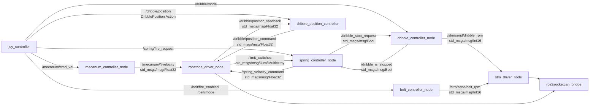

# robot_controller

`joy_controller`から受け取った機構として意味のある操作指令を、各機構の制御判断に変換するパッケージです。CANフレームの組み立てや送受信は行わず、hardware_driverへROS topicとして指令をpublishします。

## Node・topic構成



`robot_controller`は機構として意味のある速度指令だけをpublishします。CAN ID、8 byteフレーム、エンディアン、STM32との通信仕様はdriver nodeが担当します。

`stm_driver_node`は`/stm/send/belt_rpm`と`/stm/send/dribble_rpm`をsubscribeし、STM32向けCANフレームへ変換して送信します。`robstride_driver_node`はメカナム各輪の速度指令、ばね速度指令、ドリブル位置指令を担当し、ドリブルの実位置を`/dribble/position_feedback`へpublishします。いずれも`robot_controller`にはCAN送受信処理を書きません。

## 操作指令topic

`joy_controller`は機構ごとに指令topicをpublishし、各controllerは必要なtopicだけをsubscribeします。topic名はYAMLパラメータで変更できます。

## `mecanum_controller_node`

- node名: `mecanum_controller_node`
- 処理: `/mecanum/cmd_vel`の並進・角速度から、4輪メカナムのホイール角速度を計算します。

| 種別 | topic名 | 型 | 内容 |
| --- | --- | --- | --- |
| subscribe | `/mecanum/cmd_vel` | `geometry_msgs/msg/Twist` | 機体速度を受信 |
| publish | `/mecanum/*/velocity` | `std_msgs/msg/Float32` | 各輪のホイール角速度 `[rad/s]` |

主なパラメータは`wheel_radius`、`robot_length`、`robot_width`、`velocity_corrections`、`vx_sign`、`vy_sign`、`angular_z_sign`です。`velocity_corrections`は出力配列と同じ順序の4要素ベクトルで、各ホイール速度に掛けます。motor IDとCAN仕様は保持せず、hardware_driver側で管理します。

## `spring_controller_node`

- node名: `spring_controller_node`
- 処理: EduLite 05でばねを引き切り、発射後に再び装填する状態遷移を管理します。hardware_driverへは、CANではなくモータの速度指令だけをpublishします。

| 種別 | topic名（既定値） | 型 | 内容 |
| --- | --- | --- | --- |
| subscribe | `/spring/fire_request` | `std_msgs/msg/Bool` | 発射操作を受信 |
| subscribe | `/limit_switches` | `std_msgs/msg/UInt8MultiArray` | リミットスイッチ配列。`data`は`std::vector<uint8_t>`として扱い、`0=false`、非0を`true`と判定 |
| publish | `/spring_velocity_command` | `std_msgs/msg/Float32` | EduLite 05の目標速度 `[rad/s]` |

状態は`LOAD`、`READY`、`FIRE`です。

1. 起動時は`LOAD`で`loading_velocity_rad_s`をpublishし、ばねを引きます。
2. 設定した`limit_switch_index`がtrueになると`READY`へ遷移し、`0 rad/s`をpublishします。
3. `READY`中に限り、`spring_is_fire`の`false → true`を受けると`FIRE`へ遷移します。`LOAD`中の発射操作は無視します。
4. `FIRE`では`fire_velocity_rad_s`を`fire_duration_sec`の間publishし、完了後は`LOAD`に戻ります。

topic名、リミットスイッチのindex、各速度、発射時間は`robot_bringup/config/spring_controller.yaml`で設定できます。起動には`robot_bringup/launch/spring_controller.launch.py`を使います。

`stop_dribble_on_fire`が`true`の場合、`READY`で発射要求を受けると、
`spring_controller_node`は`/dribble_stop_request`へ`true`をpublishします。
`dribble_controller_node`が減速して`/dribble_is_stopped`を`true`にするまで、`FIRE`へ遷移しません。

## `belt_controller_node`

- node名: `belt_controller_node`
- 処理: `/belt/mode`をベルトの目標回転数へ変換します。`/belt/fire_enabled`が`true`の間だけ、選択中の目標回転数をpublishします。

| 種別 | topic名（既定値） | 型 | 内容 |
| --- | --- | --- | --- |
| subscribe | `/belt/fire_enabled` | `std_msgs/msg/Bool` | ベルト射出状態を受信 |
| subscribe | `/belt/mode` | `std_msgs/msg/UInt8` | ベルト速度モードを受信 |
| publish | `/stm/send/belt_rpm` | `std_msgs/msg/Int16` | hardware_driverへ送る目標回転数 `[RPM]` |

`belt_mode`は`STOP (0)`、`LEVEL_1 (1)`、`LEVEL_2 (2)`、`LEVEL_3 (3)`の4段階です。`belt_is_fire`が`false`または`belt_mode`が`STOP`の場合は、`0 RPM`をpublishします。範囲外のmodeを受けた場合も、安全側として`0 RPM`をpublishします。

`stop_rpm`、`level_1_rpm`〜`level_3_rpm`、指令周期は`robot_bringup/config/belt_controller.yaml`で設定できます。`stop_rpm`は安全のため`0 RPM`固定です。起動には`robot_bringup/launch/belt_controller.launch.py`を使います。

## `dribble_position_controller`

- node名: `dribble_position_controller`
- 処理: RobStrideの実位置feedbackを確認しながら、ドリブル機構を指定位置へ移動する`DribblePosition` Action serverです。

| 種別 | 名前（既定値） | 型 | 内容 |
| --- | --- | --- | --- |
| Action server | `/dribble/position` | `robot_controller/action/DribblePosition` | `DRIBBLE`または`SHOOT`の位置移動を受け付ける |
| publish | `/dribble/position_command` | `std_msgs/msg/Float32` | hardware_driverへ送る目標位置 `[rad]` |
| subscribe | `/dribble/position_feedback` | `std_msgs/msg/Float32` | hardware_driverから受ける実位置 `[rad]` |

ActionはGoal、Feedback、ResultをまとめたROS 2の通信方式です。Goalで移動を依頼し、移動中は現在位置と目標位置をFeedbackで返します。`DRIBBLE` Actionはドリブル位置に到達すると成功します。`SHOOT` Actionは次の順で移動し、SHOOT位置で保持します。

```text
DRIBBLE → DRIBBLE + intake_offset_rad → INTAKE → SHOOT
```

各段階は、実位置が`position_tolerance_rad`以内に到達したことを確認してから次へ進みます。SHOOT位置からは、L1+×のDRIBBLE Actionまたは緊急停止操作でドリブル位置へ戻ります。L1+○はSHOOT Actionを開始します。

`dribble_position_rad`、`intake_position_rad`、`shoot_position_rad`、`intake_offset_rad`、`position_tolerance_rad`と、Action名・topic名は`robot_bringup/config/dribble_position_controller.yaml`で設定できます。起動には`robot_bringup/launch/dribble_position_controller.launch.py`を使います。

## `dribble_controller_node`

- node名: `dribble_controller_node`
- 処理: `/dribble/mode`をドリブルの目標回転数へ変換します。ばね射出前の停止要求を受けた場合は、設定した減速度で`0 RPM`まで減速します。

| 種別 | topic名（既定値） | 型 | 内容 |
| --- | --- | --- | --- |
| subscribe | `/dribble/mode` | `std_msgs/msg/UInt8` | ドリブル速度モードを受信 |
| subscribe | `/dribble_stop_request` | `std_msgs/msg/Bool` | ばねcontrollerからの停止要求 |
| publish | `/stm/send/dribble_rpm` | `std_msgs/msg/Int16` | hardware_driverへ送る目標回転数 `[RPM]` |
| publish | `/dribble_is_stopped` | `std_msgs/msg/Bool` | 停止完了状態 |

`dribble_mode`は`STOP (0)`、`HIGH (1)`、`LOW (2)`の3段階です。`LOW`と`HIGH`の目標回転数、停止時の減速度、指令周期は`robot_bringup/config/dribble_controller.yaml`で設定できます。

停止完了は、今回の実装では減速後の目標回転数が`0 RPM`へ到達した時点で通知します。実速度のCANフィードバックが追加されたら、実測速度が0付近であることを確認する方式へ変更します。
