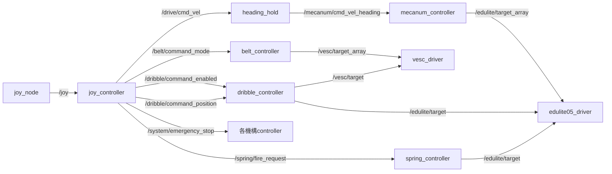

# robot_controller

ROX2026の機構制御、走行補正、競技用自動制御をまとめたROS 2パッケージです。操作入力や自動制御の要求を受け、`hardware_driver` が扱うVESC・EduLite 05向けのアクチュエーター目標値へ変換します。

## 主なノード

| ノード | 役割 | 詳細 |
|---|---|---|
| `mecanum_controller_node` | 機体速度から4輪の角速度を計算 | [mecanum.md](../../../docs/controllers/mecanum.md) |
| `heading_hold_node` | IMUを使った旋回方向保持と速度指令補正 | `config/heading_hold.yaml` |
| `spring_controller_node` | 原点復帰、待機位置、通常・低速発射 | [spring.md](../../../docs/controllers/spring.md) |
| `belt_controller_node` | 上下ベルトのレベル・RPM制御 | `config/belt_controller.yaml` |
| `dribble_controller_node` | ローラー、アーム姿勢、Shot Cycle | [dribble.md](../../../docs/controllers/dribble.md) |
| `led_controller_node` | ロボット状態を64 bit LED指令へ集約 | `config/led_controller.yaml` |
| `game2_aim_node` / `pk_aim_node` | AprilTagを用いた自動照準 | [game2-aim.md](../../../docs/controllers/game2-aim.md) |

表中の設定ファイルは `../robot_bringup/config/` 配下にあります。

## 通常のデータ経路


```mermaid
flowchart LR
  joy[joy_node] -->|/joy| input[joy_controller]
  input -->|/drive/cmd_vel| heading[heading_hold]
  heading -->|/mecanum/cmd_vel_heading| mecanum[mecanum_controller]
  mecanum -->|/edulite/target_array| edulite[edulite05_driver]

  input -->|/belt/command_mode| belt[belt_controller]
  belt -->|/vesc/target_array| vesc[vesc_driver]

  input -->|/dribble/command_enabled| dribble[dribble_controller]
  input -->|/dribble/command_position| dribble
  dribble -->|/vesc/target| vesc
  dribble -->|/edulite/target| edulite

  input -->|/spring/fire_request| spring[spring_controller]
  spring -->|/edulite/target| edulite

  input -->|/system/emergency_stop| controllers[各機構controller]
```

`/drive/cmd_vel` は手動操作と自動制御で共有されます。Heading Holdが無効な場合も `heading_hold_node` が入力を通過させ、メカナム制御は `/mecanum/cmd_vel_heading` を受け取ります。

## Shot Cycle

通常の自動射出要求は `/dribble/shot_cycle_request` で `dribble_controller_node` が受け取ります。

1. ベルトが停止中なら、指定レベルでベルトを起動します。
2. ドリブルローラーを準備回転数へ上げ、Springへ退避要求を送ります。
3. 最短待機時間とSpringの退避完了を確認して、アームを `FEED` へ動かします。
4. FEED軌道の途中でローラーを停止し、押し込み後に `RETURNING` へ移ります。
5. ローラーを再始動し、アームとSpringを待機位置へ戻します。
6. Shot Cycleが起動したベベルトだけを停止します。

正確な状態遷移とタイムアウトは[ドリブルコントローラー資料](../../../docs/controllers/dribble.md)を参照してください。

## 非常停止と入力断

- ソフトウェア非常停止は `/system/emergency_stop` で共有します。
- 各機構ノードは非常停止を個別に処理し、停止指令や状態遷移を安全側へ戻します。
- Joy入力が `joy_timeout_ms` を超えて途絶えると、`joy_controller` が走行・ベルト・ドリブルの停止指令を送ります。
- 非常停止トピックだけに依存せず、VESC・EduLite・各controllerにも個別のtimeoutがあります。

## ビルドとテスト

```bash
cd /root/ros2_ws
colcon build --symlink-install --packages-select robot_controller
source install/setup.bash
colcon test --packages-select robot_controller
colcon test-result --verbose
```

実機試験は機構別launchを使用し、非常停止、指令timeout、CAN feedback断、再接続を1系統ずつ確認してください。
