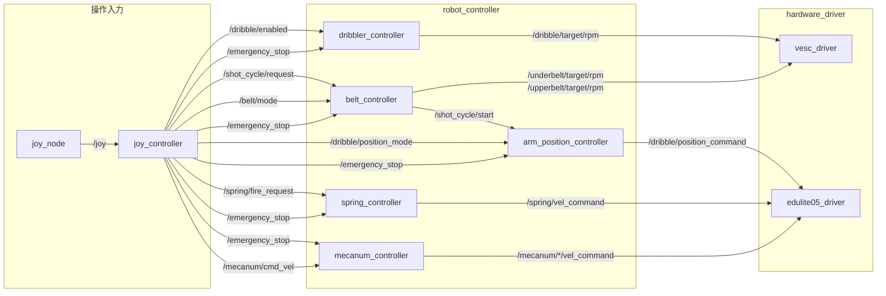

# robot_controller

Joyから受けた機構指令と非常停止トピック（`/emergency_stop`）を制御判断へ変換し、各専門コントローラーノードが自律して `hardware_driver` へ機構目標値をパブリッシュする。

## ノード構成・役割一覧

1. **`mecanum_controller_node`**:
   - 足回り（4輪オムニ/メカナム）の逆運動学計算および車輪速度出力。
2. **`spring_controller_node`**:
   - ばねの自動装填および解放（発射）制御。
3. **`belt_controller_node`**:
   - 上下ベルト（アンダー/アッパー）の目標RPM回転速度制御。
4. **`dribbler_controller_node`**:
   - ボール巻き込み用ドリブルローラーの目標RPM回転速度制御。
5. **`arm_position_controller_node`**:
   - ボール取り込み・押し出し供給用アームの角度位置制御（`DRIBBLE`, `OPEN`, `FEED`）。

---

## システム全体系トピック・ノード構成


```mermaid
flowchart LR
  subgraph input["操作入力"]
    joy["joy_node"]
    joy_controller["joy_controller"]
    joy -->|"/joy"| joy_controller
  end

  subgraph controllers["robot_controller"]
    mecanum["mecanum_controller"]
    spring["spring_controller"]
    belt["belt_controller"]
    dribbler["dribbler_controller"]
    arm["arm_position_controller"]
  end

  subgraph drivers["hardware_driver"]
    vesc["vesc_driver"]
    edulite["edulite05_driver"]
  end

  joy_controller -->|"/mecanum/cmd_vel"| mecanum
  joy_controller -->|"/emergency_stop"| mecanum
  joy_controller -->|"/emergency_stop"| spring
  joy_controller -->|"/emergency_stop"| belt
  joy_controller -->|"/emergency_stop"| dribbler
  joy_controller -->|"/emergency_stop"| arm

  joy_controller -->|"/belt/mode"| belt
  joy_controller -->|"/dribble/enabled"| dribbler
  joy_controller -->|"/dribble/position_mode"| arm
  joy_controller -->|"/spring/fire_request"| spring
  joy_controller -->|"/shot_cycle/request"| belt
  belt -->|"/shot_cycle/start"| arm

  belt -->|"/underbelt/target/rpm<br/>/upperbelt/target/rpm"| vesc
  dribbler -->|"/dribble/target/rpm"| vesc
  mecanum -->|"/mecanum/*/vel_command"| edulite
  spring -->|"/spring/vel_command"| edulite
  arm -->|"/dribble/position_command"| edulite
```

---

## システム全体の状態遷移・連携の仕組み

### 1. 自動シュート（Shot Cycle）の連携フロー
操縦者が **`L2 + ○`** ボタンを押すと、全自動で以下のシーケンスが実行されます。

```
[ JoyController ]
     │ L2+○ 押下 ➔ /shot_cycle/request (true) をパブリッシュ
     ▼
[ belt_controller ]
     │ ベルトを目標RPM（Level 1〜6）に加速
     │ 上下ベルトの実RPMが目標値に到達＆0.3秒安定維持（ready）を確認
     ▼ /shot_cycle/start (true) をパブリッシュ
[ arm_position_controller ]
     │
     ├──① [ Mode: OPEN (-1.0 rad) ] ──> アームがパカッと開いてボール受球
     │     │ (目標角度到達)
     │     ▼
     ├──② [ Mode: FEED (1.3 rad) ] ───> ボールをベルトへグッと押し込み（シュート！）
     │     │ (目標角度到達 ➔ 0.6秒保持)
     │     ▼
     └──③ [ Mode: DRIBBLE (0.35 rad) ] ─> 通常姿勢へ自動復帰
```

---

### 2. 各ノードごとの独立状態一覧

#### 🛞 `mecanum_controller`
- **状態**: なし（純粋な4輪キネマティクス計算機）
- **遷移**: `/emergency_stop == true` ➔ 0 rad/s 停止。それ以外 ➔ ジョイスティック入力に従い全方向走行。

#### 🔫 `spring_controller`
- **状態**: `LOAD` (自動再装填) ➔ `READY` (準備完了) ➔ `FIRE` (ばね解放)
- **遷移**: リミットスイッチONで `READY`。`L1+○` 押下で `FIRE` 実行。

#### ──────── `belt_controller`
- **状態**: `BeltMode` (`STOP`, `LEVEL_1` 〜 `LEVEL_6`: 3000〜5500 RPM)
- **遷移**: 十字キー上下でレベル変更。`/emergency_stop == true` ➔ 0 RPM 停止。

#### 🌀 `dribbler_controller`
- **状態**: `dribble_enabled_` (`true`: 2000 RPM / `false`: 0 RPM)
- **遷移**: `R1` ボタンでON/OFF。`/emergency_stop == true` ➔ 0 RPM 停止。

#### 🦾 `arm_position_controller`
- **状態**: `PositionMode` (`DRIBBLE`: 0.35rad / `OPEN`: -1.0rad / `FEED`: 1.3rad)
- **遷移**: `R2 + DPAD左右` で手動位置切替。シュート時は自動一貫シーケンス。`/emergency_stop == true` ➔ 強制的に `DRIBBLE` 位置復帰。

#### 🎮 `joy_controller`
- **状態**: `is_emergency_stop_` (非常停止: `HOME`ボタン) / `forward_reverse_` (前後反転: `PS`ボタン)
- **保護**: 200ms以上の入力断時に自動で停止・非常停止を安全パブリッシュ。
