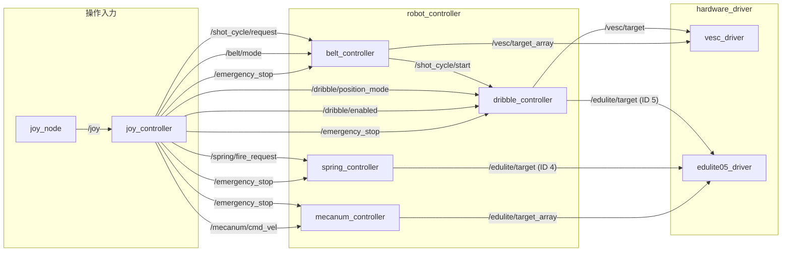

# robot_controller

Joyから受けた機構指令と非常停止トピック（`/emergency_stop`）を制御判断へ変換し、各専門コントローラーノードが自律して `hardware_driver` へ機構目標値をパブリッシュする。

## ノード構成・役割一覧

1. **`mecanum_controller_node`**:
   - 足回り（4輪オムニ/メカナム）の逆運動学計算および車輪速度出力。
2. **`spring_controller_node`**:
   - ばねの自動装填および解放（発射）制御。
3. **`belt_controller_node`**:
   - 上下ベルト（アンダー/アッパー）の目標RPM回転速度制御。
4. **`dribble_controller_node`**:
   - ドリブルローラーのRPMと姿勢角度（`DRIBBLE`, `OPEN`, `FEED`）を統合制御。

---

## システム全体系トピック・ノード構成


```mermaid
flowchart LR
  subgraph input["操作入力"]
    joy["joy_node"]
    joy_controller["joy_controller"]
    joy -->|"/joy"| joy_controller
  end

  subgraph controllers["robot_controller"]
    mecanum["mecanum_controller"]
    spring["spring_controller"]
    belt["belt_controller"]
    dribble["dribble_controller"]
  end

  subgraph drivers["hardware_driver"]
    vesc["vesc_driver"]
    edulite["edulite05_driver"]
  end

  joy_controller -->|"/mecanum/cmd_vel"| mecanum
  joy_controller -->|"/emergency_stop"| mecanum
  joy_controller -->|"/emergency_stop"| spring
  joy_controller -->|"/emergency_stop"| belt
  joy_controller -->|"/emergency_stop"| dribble

  joy_controller -->|"/belt/mode"| belt
  joy_controller -->|"/dribble/enabled"| dribble
  joy_controller -->|"/dribble/position_mode"| dribble
  joy_controller -->|"/spring/fire_request"| spring
  joy_controller -->|"/shot_cycle/request"| belt
  belt -->|"/shot_cycle/start"| dribble

  belt -->|"/vesc/target_array"| vesc
  dribble -->|"/vesc/target"| vesc
  mecanum -->|"/edulite/target_array"| edulite
  spring -->|"/edulite/target (ID 4)"| edulite
  dribble -->|"/edulite/target (ID 5)"| edulite
```

---

## システム全体の状態遷移・連携の仕組み

### 1. 自動シュート（Shot Cycle）の連携フロー
操縦者が **`L2 + ○`** ボタンを押すと、全自動で以下のシーケンスが実行されます。

```
[ JoyController ]
     │ L2+○ 押下 ➔ /shot_cycle/request (true) をパブリッシュ
     ▼
[ belt_controller ]
     │ ベルトを目標RPM（Level 1〜6）に加速
     │ 上下ベルトの実RPMが目標値に到達＆0.3秒安定維持（ready）を確認
     ▼ /shot_cycle/start (true) をパブリッシュ
[ dribble_controller ]
     │
     ├──① [ Mode: OPEN (-1.0 rad) ] ──> アームが開いてボールを受ける
     │     │ 0.3秒間保持
     │     ▼
     ├──② [ Mode: FEED (1.3 rad) ] ───> ボールをベルトへグッと押し込み（シュート！）
     │     │ 0.6秒間保持
     │     ▼
     └──③ [ Mode: DRIBBLE (0.35 rad) ] ─> 通常姿勢へ自動復帰
```

---

### 2. 各ノードごとの独立状態一覧

#### 🛞 `mecanum_controller`
- **状態**: なし（純粋な4輪キネマティクス計算機）
- **遷移**: `/emergency_stop == true` ➔ 0 rad/s 停止。それ以外 ➔ ジョイスティック入力に従い全方向走行。

#### 🔫 `spring_controller`
- **状態**: `LOAD` (自動再装填) ➔ `READY` (準備完了) ➔ `FIRE` (ばね解放)
- **遷移**: リミットスイッチONで `READY`。`L1+○` 押下で `FIRE` 実行。

#### ──────── `belt_controller`
- **状態**: `BeltMode` (`STOP`, `LEVEL_1` 〜 `LEVEL_4`)
- **速度設定**: 各レベルの上下ベルトRPMを個別に設定でき、実行中のparameter変更にも対応
- **送信方式**: 指令受信時は即時送信し、非常停止中のみゼロ指令を周期送信
- **設定再読み込み**: `ros2 param load /belt_controller_node ros2_ws/src/robot_bringup/config/belt_controller.yaml`
- **遷移**: 十字キー上下でレベル変更。`/emergency_stop == true` ➔ 0 RPM 停止。

#### 🌀 `dribble_controller`
- **ローラー**: R1でON/OFF。非常停止時は0 RPM。
- **姿勢**: `DRIBBLE`、`OPEN`、`FEED`。シュート時は自動シーケンス。
- **非常停止**: ローラーを停止し、姿勢を`DRIBBLE`位置へ戻す。

#### 🎮 `joy_controller`
- **状態**: `is_emergency_stop_` (非常停止: `HOME`ボタン) / `forward_reverse_` (前後反転: `PS`ボタン)
- **保護**: 200ms以上の入力断時に自動で停止・非常停止を安全パブリッシュ。
