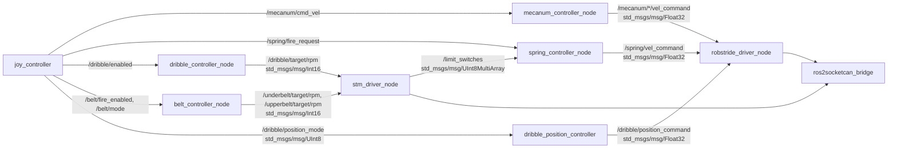

# robot_controller

`joy_controller`から受け取った機構として意味のある操作指令を、各機構の制御判断に変換するパッケージです。CANフレームの組み立てや送受信は行わず、hardware_driverへROS topicとして指令をpublishします。

## Node・topic構成


```mermaid
flowchart LR
  joy[joy_controller]
  mecanum[mecanum_controller_node]
  spring[spring_controller_node]
  dribble[dribble_controller_node]
  position[dribble_position_controller]
  belt[belt_controller_node]
  stm_driver[stm_driver_node]
  robstride_driver[robstride_driver_node]
  bridge[ros2socketcan_bridge]

  joy -->|/mecanum/cmd_vel| mecanum
  joy -->|/spring/fire_request| spring
  joy -->|/dribble/enabled| dribble
  joy -->|/belt/fire_enabled, /belt/mode| belt
  joy -->|/dribble/position_mode\nstd_msgs/msg/UInt8| position

  mecanum -->|/mecanum/*/vel_command\nstd_msgs/msg/Float32| robstride_driver
  spring -->|/spring/vel_command\nstd_msgs/msg/Float32| robstride_driver
  dribble -->|/dribble/target/rpm\nstd_msgs/msg/Int16| stm_driver
  belt -->|/underbelt/target/rpm, /upperbelt/target/rpm\nstd_msgs/msg/Int16| stm_driver
  position -->|/dribble/position_command\nstd_msgs/msg/Float32| robstride_driver
  stm_driver -->|/limit_switches\nstd_msgs/msg/UInt8MultiArray| spring

  stm_driver --> bridge
  robstride_driver --> bridge
```

`robot_controller`は機構として意味のある速度指令だけをpublishします。CAN ID、8 byteフレーム、エンディアン、STM32との通信仕様はdriver nodeが担当します。

`stm_driver_node`は`/underbelt/target/rpm`、`/upperbelt/target/rpm`、`/dribble/target/rpm`をsubscribeし、STM32向けCANフレームへ変換して送信します。また、STM32から受けたリミットスイッチ状態を`/limit_switches`(`std_msgs/msg/UInt8MultiArray`、1バイトをbitごとに1スイッチとして展開)へpublishします。`robstride_driver_node`はメカナム各輪の速度指令、ばね速度指令、ドリブル位置指令を担当します。いずれも`robot_controller`にはCAN送受信処理を書きません。

## 操作指令topic

`joy_controller`は機構ごとに指令topicをpublishし、各controllerは必要なtopicだけをsubscribeします。topic名はYAMLパラメータで変更できます。

## `mecanum_controller_node`

- node名: `mecanum_controller_node`
- 処理: `/mecanum/cmd_vel`の並進・角速度から、4輪メカナムのホイール角速度を計算します。

| 種別 | topic名 | 型 | 内容 |
| --- | --- | --- | --- |
| subscribe | `/mecanum/cmd_vel` | `geometry_msgs/msg/Twist` | 機体速度を受信 |
| publish | `/mecanum/*/vel_command` | `std_msgs/msg/Float32` | 各輪のホイール角速度 `[rad/s]` |

主なパラメータは`wheel_radius`、`robot_length`、`robot_width`、`velocity_corrections`、`vx_sign`、`vy_sign`、`angular_z_sign`です。`velocity_corrections`は出力配列と同じ順序の4要素ベクトルで、各ホイール速度に掛けます。motor IDとCAN仕様は保持せず、hardware_driver側で管理します。

## `spring_controller_node`

- node名: `spring_controller_node`
- 処理: EduLite 05でばねを引き切り、発射後に再び装填する状態遷移を管理します。hardware_driverへは、CANではなくモータの速度指令だけをpublishします。

| 種別 | topic名（既定値） | 型 | 内容 |
| --- | --- | --- | --- |
| subscribe | `/spring/fire_request` | `std_msgs/msg/Bool` | 発射操作を受信 |
| subscribe | `/limit_switches` | `std_msgs/msg/UInt8MultiArray` | リミットスイッチ配列。`data`は`std::vector<uint8_t>`として扱い、`0=false`、非0を`true`と判定 |
| publish | `/spring/vel_command` | `std_msgs/msg/Float32` | EduLite 05の目標速度 `[rad/s]` |

状態は`LOAD`、`READY`、`FIRE`です。

1. 起動時は`LOAD`で`loading_velocity_rad_s`をpublishし、ばねを引きます。
2. 設定した`limit_switch_index`がtrueになると`READY`へ遷移し、`0 rad/s`をpublishします。
3. `READY`中に限り、`/spring/fire_request`の`false → true`を受けると`FIRE`へ遷移します。`LOAD`中の発射操作は無視します。
4. `FIRE`では`fire_velocity_rad_s`を`fire_duration_sec`の間publishし、完了後は`LOAD`に戻ります。

topic名、リミットスイッチのindex、各速度、発射時間は`robot_bringup/config/spring_controller.yaml`で設定できます。起動には`robot_bringup/launch/spring_controller.launch.py`を使います。

## `belt_controller_node`

- node名: `belt_controller_node`
- 処理: `/belt/mode`をベルトの目標回転数へ変換します。`/belt/fire_enabled`が`true`の間だけ、選択中の目標回転数をpublishします。under/upperの2モータへ同一RPMを2本publishします。

| 種別 | topic名（既定値） | 型 | 内容 |
| --- | --- | --- | --- |
| subscribe | `/belt/fire_enabled` | `std_msgs/msg/Bool` | ベルト射出状態を受信 |
| subscribe | `/belt/mode` | `std_msgs/msg/UInt8` | ベルト速度モードを受信 |
| publish | `/underbelt/target/rpm` | `std_msgs/msg/Int16` | hardware_driver(STM32)へ送るunder側目標回転数 `[RPM]` |
| publish | `/upperbelt/target/rpm` | `std_msgs/msg/Int16` | hardware_driver(STM32)へ送るupper側目標回転数 `[RPM]` |

`belt_mode`は`STOP (1)`、`LEVEL_1 (2)`、`LEVEL_2 (3)`、`LEVEL_3 (4)`の4段階です。`belt_is_fire`が`false`または`belt_mode`が`STOP`の場合は、`0 RPM`をpublishします。範囲外のmodeを受けた場合も、安全側として`0 RPM`をpublishします。

`stop_rpm`、`level_1_rpm`〜`level_3_rpm`、指令周期は`robot_bringup/config/belt_controller.yaml`で設定できます。`stop_rpm`は安全のため`0 RPM`固定です。起動には`robot_bringup/launch/belt_controller.launch.py`を使います。

## `dribble_position_controller`

- node名: `dribble_position_controller`
- 処理: `/dribble/position_mode`を受け取り、ドリブル機構を指定位置へ移動する目標位置をpublishします。実位置feedbackは見ず、時間で位置を進める簡易方式です。

| 種別 | topic名（既定値） | 型 | 内容 |
| --- | --- | --- | --- |
| subscribe | `/dribble/position_mode` | `std_msgs/msg/UInt8` | 位置指令。`0=DRIBBLE`、`1=SHOOT` |
| publish | `/dribble/position_command` | `std_msgs/msg/Float32` | hardware_driverへ送る目標位置 `[rad]` |

`DRIBBLE (0)`を受けると`dribble_position_rad`へ移動します。`SHOOT (1)`を受けるとまず`intake_position_rad`へ移動し、`intake_to_shoot_delay_sec`経過後に`shoot_position_rad`へ移動して保持します。

```text
SHOOT指令: INTAKE → (intake_to_shoot_delay_sec) → SHOOT
```

feedbackによる到達確認は行わず、SHOOTのINTAKE→SHOOT遷移は時間で判断します。SHOOT位置からは、L1+×のDRIBBLE指令または緊急停止操作でドリブル位置へ戻ります。L1+○はSHOOT指令を送ります。

`dribble_position_rad`、`intake_position_rad`、`shoot_position_rad`、`intake_to_shoot_delay_sec`、topic名は`robot_bringup/config/dribble_position_controller.yaml`で設定できます。起動には`robot_bringup/launch/dribble_position_controller.launch.py`を使います。

## `dribble_controller_node`

- node名: `dribble_controller_node`
- 処理: `/dribble/enabled`のON/OFFを目標回転数へ変換します。

| 種別 | topic名（既定値） | 型 | 内容 |
| --- | --- | --- | --- |
| subscribe | `/dribble/enabled` | `std_msgs/msg/Bool` | ドリブルのON/OFFを受信 |
| publish | `/dribble/target/rpm` | `std_msgs/msg/Int16` | hardware_driver(STM32)へ送る目標回転数 `[RPM]` |

`true`なら`on_rpm`、`false`なら`0 RPM`を`command_period_ms`周期でpublishします。`on_rpm`と指令周期は`robot_bringup/config/dribble_controller.yaml`で設定できます。
