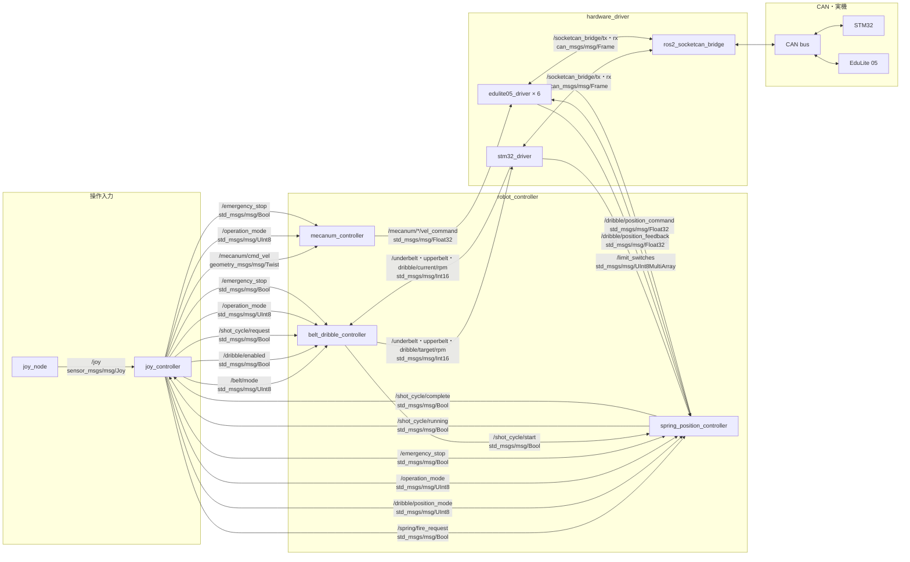

# robot_controller

Joyから受けた機構指令と`/operation_mode`を制御判断へ変換し、hardware_driverへ
機構として意味のある目標値をpublishする。CAN ID、フレーム形式、エンディアンは
hardware_driverが担当する。

## node・topic構成


```mermaid
flowchart LR
  subgraph input["操作入力"]
    joy["joy_node"]
    joy_controller["joy_controller"]
    joy -->|"/joy<br/>sensor_msgs/msg/Joy"| joy_controller
  end

  subgraph controllers["robot_controller"]
    mecanum["mecanum_controller"]
    belt_dribble["belt_dribble_controller"]
    spring_position["spring_position_controller"]
  end

  subgraph drivers["hardware_driver"]
    stm32["stm32_driver"]
    edulite["edulite05_driver × 6"]
    socketcan["ros2_socketcan_bridge"]
  end

  subgraph hardware["CAN・実機"]
    can["CAN bus"]
    stm32_board["STM32"]
    edulite_motors["EduLite 05"]
  end

  joy_controller -->|"/mecanum/cmd_vel<br/>geometry_msgs/msg/Twist"| mecanum
  joy_controller -->|"/operation_mode<br/>std_msgs/msg/UInt8"| mecanum
  joy_controller -->|"/emergency_stop<br/>std_msgs/msg/Bool"| mecanum

  joy_controller -->|"/belt/mode<br/>std_msgs/msg/UInt8"| belt_dribble
  joy_controller -->|"/dribble/enabled<br/>std_msgs/msg/Bool"| belt_dribble
  joy_controller -->|"/shot_cycle/request<br/>std_msgs/msg/Bool"| belt_dribble
  joy_controller -->|"/operation_mode<br/>std_msgs/msg/UInt8"| belt_dribble
  joy_controller -->|"/emergency_stop<br/>std_msgs/msg/Bool"| belt_dribble

  joy_controller -->|"/spring/fire_request<br/>std_msgs/msg/Bool"| spring_position
  joy_controller -->|"/dribble/position_mode<br/>std_msgs/msg/UInt8"| spring_position
  joy_controller -->|"/operation_mode<br/>std_msgs/msg/UInt8"| spring_position
  joy_controller -->|"/emergency_stop<br/>std_msgs/msg/Bool"| spring_position
  belt_dribble -->|"/shot_cycle/start<br/>std_msgs/msg/Bool"| spring_position
  spring_position -->|"/shot_cycle/running<br/>std_msgs/msg/Bool"| joy_controller
  spring_position -->|"/shot_cycle/complete<br/>std_msgs/msg/Bool"| joy_controller

  belt_dribble -->|"/underbelt・upperbelt・dribble/target/rpm<br/>std_msgs/msg/Int16"| stm32
  stm32 -->|"/underbelt・upperbelt・dribble/current/rpm<br/>std_msgs/msg/Int16"| belt_dribble
  stm32 -->|"/limit_switches<br/>std_msgs/msg/UInt8MultiArray"| spring_position

  mecanum -->|"/mecanum/*/vel_command<br/>std_msgs/msg/Float32"| edulite
  spring_position -->|"/spring/vel_command<br/>std_msgs/msg/Float32"| edulite
  spring_position -->|"/dribble/position_command<br/>std_msgs/msg/Float32"| edulite
  edulite -->|"/dribble/position_feedback<br/>std_msgs/msg/Float32"| spring_position

  stm32 <-->|"/socketcan_bridge/tx・rx<br/>can_msgs/msg/Frame"| socketcan
  edulite <-->|"/socketcan_bridge/tx・rx<br/>can_msgs/msg/Frame"| socketcan
  socketcan <--> can
  can <--> stm32_board
  can <--> edulite_motors
```

`vesc_driver`は`robot.launch.py`の通常起動では無効で、必要な場合だけ起動する。
目標RPMと実RPMのtopic型はどちらも`std_msgs/msg/Int16`とする。

## node構成

```text
joy_controller
  ├─ operation_mode ──────────┬─ belt_dribble_controller
  │                           ├─ spring_position_controller
  │                           └─ mecanum_controller
  ├─ belt / dribble指令 ─────── belt_dribble_controller
  ├─ Spring / position指令 ──── spring_position_controller
  └─ cmd_vel ───────────────── mecanum_controller
```

| node | 主な責務 | config |
|---|---|---|
| `belt_dribble_controller_node` | belt・dribbleの目標RPM送信、3実RPMの到達判定 | `belt_dribble_controller.yaml` |
| `spring_position_controller_node` | Spring状態遷移、position feedbackによる位置遷移 | `spring_position_controller.yaml` |
| `mecanum_controller_node` | mode制限と4輪メカナム逆運動学 | `mecanum_controller.yaml` |

## operation mode

| 値 | mode | belt・dribble | Spring・position | mecanum |
|---:|---|---|---|---|
| 0 | STOP | 全targetを0 RPM | Springを装填して停止、DRIBBLE位置へ復帰 | 全輪停止 |
| 1 | DRIVE | 通常制御 | Spring・手動position可 | 通常走行 |
| 2 | SHOT_CYCLE | RPM到達判定 | Spring禁止、shot cycle可 | 旋回のみ |
| 3 | BELT_ONLY | belt通常、dribble 0 RPM | Spring禁止、OPENへ移動 | 旋回のみ |

非常停止はoperation modeより優先する。

## belt_dribble_controller_node

### subscribe

| topic | 型 | 内容 |
|---|---|---|
| `/operation_mode` | `std_msgs/msg/UInt8` | 現在のoperation mode |
| `/belt/mode` | `std_msgs/msg/UInt8` | belt速度mode |
| `/dribble/enabled` | `std_msgs/msg/Bool` | dribble通常ON/OFF |
| `/shot_cycle/request` | `std_msgs/msg/Bool` | L2+○による実行要求 |
| `/underbelt/current/rpm` | `std_msgs/msg/Int16` | underbelt実RPM |
| `/upperbelt/current/rpm` | `std_msgs/msg/Int16` | upperbelt実RPM |
| `/dribble/current/rpm` | `std_msgs/msg/Int16` | dribble実RPM |
| `/emergency_stop` | `std_msgs/msg/Bool` | 非常停止 |

### publish

| topic | 型 | 内容 |
|---|---|---|
| `/underbelt/target/rpm` | `std_msgs/msg/Int16` | underbelt目標RPM |
| `/upperbelt/target/rpm` | `std_msgs/msg/Int16` | upperbelt目標RPM |
| `/dribble/target/rpm` | `std_msgs/msg/Int16` | dribble目標RPM |
| `/shoot_ready` | `std_msgs/msg/Bool` | 3モータのRPM到達状態 |
| `/shot_cycle/start` | `std_msgs/msg/Bool` | shot cycle開始 |

SHOT_CYCLE中に3実RPMが各targetの許容範囲内へ入り、
`ready_hold_sec`継続すると`/shoot_ready=true`になる。この状態で
`/shot_cycle/request=true`を受けた場合だけ`/shot_cycle/start=true`を一度publishする。
未到達時の要求は予約せず無視する。

`/belt/mode`は`0=STOP`、`1〜6=LEVEL_1〜LEVEL_6`として扱う。

## spring_position_controller_node

Springは`LOAD`、`READY`、`FIRE`、`ERROR`の状態を持つ。発射要求はDRIVEだけで
立ち上がりを受け付ける。STOP、Joy通信断、SHOT_CYCLE、BELT_ONLYでは
発射を中断し、リミットスイッチがONになるまでLOAD速度で巻き取ってから停止する。
LOADが`load_timeout_sec`を超えた場合はERRORへ入り、`0 rad/s`で停止する。
リミットスイッチがONになるとREADYへ復帰する。

positionは移動中、`position_command_period_ms`周期で同じ目標radを送り続け、
`/dribble/position_feedback`が許容範囲内へ入ったことを確認して次へ進む。
実際にshot cycleを開始したときは`/shot_cycle/running=true`をpublishし、
完了または中断時に`false`へ戻す。

位置移動がtimeoutした場合はシーケンスを失敗終了し、DRIBBLE位置へ一度だけ戻す。
DRIBBLEへの復帰もtimeoutした場合は位置指令を停止する。この場合は
`/shot_cycle/complete`をpublishしないため、SHOT_CYCLEの待機状態に残る。

```text
/shot_cycle/start=true
  → INTAKE
  → feedback到達
  → SHOOT
  → feedback到達・保持
  → DRIBBLE
  → feedback到達
  → /shot_cycle/complete=true
```

手動position指令はDRIVEとSHOT_CYCLEの待機中だけ受け付ける。

| `/dribble/position_mode` | 位置 |
|---:|---|
| 0 | DRIBBLE |
| 1 | INTAKE |
| 2 | SHOOT |
| 3 | OPEN |

BELT_ONLYへ入ると自動でOPENへ移動し、DRIVEへ戻るとDRIBBLEへ復帰する。
STOPと非常停止でもDRIBBLE位置へ復帰する。

## mecanum_controller_node

`/mecanum/cmd_vel`を4輪の角速度へ変換する。

- STOPまたは非常停止: `linear.x/y`と`angular.z`をすべて0にする。
- DRIVE: 全速度成分を通す。
- SHOT_CYCLE・BELT_ONLY: `linear.x/y`を0にし、`angular.z`だけ通す。

mode変更callbackでも直前のcmd_velから再計算するため、次のJoy入力を待たず制限を反映する。

## 起動

全controllerとhardware、Joyは以下で起動する。

```bash
ros2 launch robot_bringup robot.launch.py
```
