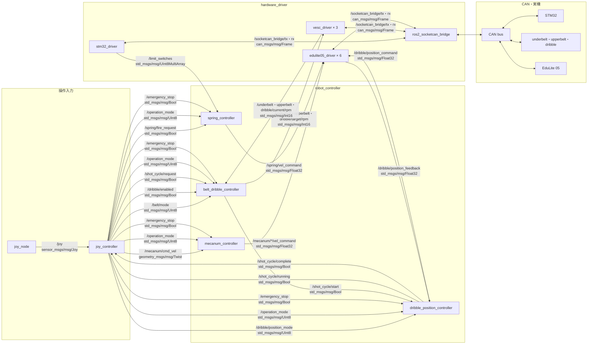

# robot_controller

Joyから受けた機構指令と`/operation_mode`を制御判断へ変換し、hardware_driverへ
機構として意味のある目標値をpublishする。CAN ID、フレーム形式、エンディアンは
hardware_driverが担当する。

## node別の詳細資料

- [belt_dribble_controller_node](belt_dribble_controller/README.md)
- [spring_controller_node](spring_controller/README.md)
- [dribble_position_controller](dribble_position_controller/README.md)
- [mecanum_controller_node](mecanum_controller/README.md)

このREADMEはnode間の接続とシステム全体の動作を説明する。callback、timer、
内部状態、安全動作を確認してからsourceを読む場合は、上記の個別READMEを参照する。

## node・topic構成


```mermaid
flowchart LR
  subgraph input["操作入力"]
    joy["joy_node"]
    joy_controller["joy_controller"]
    joy -->|"/joy<br/>sensor_msgs/msg/Joy"| joy_controller
  end

  subgraph controllers["robot_controller"]
    mecanum["mecanum_controller"]
    belt_dribble["belt_dribble_controller"]
    spring["spring_controller"]
    dribble_position["dribble_position_controller"]
  end

  subgraph drivers["hardware_driver"]
    stm32["stm32_driver"]
    vesc["vesc_driver × 3"]
    edulite["edulite05_driver × 6"]
    socketcan["ros2_socketcan_bridge"]
  end

  subgraph hardware["CAN・実機"]
    can["CAN bus"]
    stm32_board["STM32"]
    belt_motors["underbelt・upperbelt・dribble"]
    edulite_motors["EduLite 05"]
  end

  joy_controller -->|"/mecanum/cmd_vel<br/>geometry_msgs/msg/Twist"| mecanum
  joy_controller -->|"/operation_mode<br/>std_msgs/msg/UInt8"| mecanum
  joy_controller -->|"/emergency_stop<br/>std_msgs/msg/Bool"| mecanum

  joy_controller -->|"/belt/mode<br/>std_msgs/msg/UInt8"| belt_dribble
  joy_controller -->|"/dribble/enabled<br/>std_msgs/msg/Bool"| belt_dribble
  joy_controller -->|"/shot_cycle/request<br/>std_msgs/msg/Bool"| belt_dribble
  joy_controller -->|"/operation_mode<br/>std_msgs/msg/UInt8"| belt_dribble
  joy_controller -->|"/emergency_stop<br/>std_msgs/msg/Bool"| belt_dribble

  joy_controller -->|"/spring/fire_request<br/>std_msgs/msg/Bool"| spring
  joy_controller -->|"/dribble/position_mode<br/>std_msgs/msg/UInt8"| dribble_position
  joy_controller -->|"/operation_mode<br/>std_msgs/msg/UInt8"| spring
  joy_controller -->|"/operation_mode<br/>std_msgs/msg/UInt8"| dribble_position
  joy_controller -->|"/emergency_stop<br/>std_msgs/msg/Bool"| spring
  joy_controller -->|"/emergency_stop<br/>std_msgs/msg/Bool"| dribble_position
  belt_dribble -->|"/shot_cycle/start<br/>std_msgs/msg/Bool"| dribble_position
  dribble_position -->|"/shot_cycle/running<br/>std_msgs/msg/Bool"| joy_controller
  dribble_position -->|"/shot_cycle/complete<br/>std_msgs/msg/Bool"| joy_controller

  belt_dribble -->|"/underbelt・upperbelt・dribble/target/rpm<br/>std_msgs/msg/Int16"| vesc
  vesc -->|"/underbelt・upperbelt・dribble/current/rpm<br/>std_msgs/msg/Int16"| belt_dribble
  stm32 -->|"/limit_switches<br/>std_msgs/msg/UInt8MultiArray"| spring

  mecanum -->|"/mecanum/*/vel_command<br/>std_msgs/msg/Float32"| edulite
  spring -->|"/spring/vel_command<br/>std_msgs/msg/Float32"| edulite
  dribble_position -->|"/dribble/position_command<br/>std_msgs/msg/Float32"| edulite
  edulite -->|"/dribble/position_feedback<br/>std_msgs/msg/Float32"| dribble_position

  stm32 <-->|"/socketcan_bridge/tx・rx<br/>can_msgs/msg/Frame"| socketcan
  vesc <-->|"/socketcan_bridge/tx・rx<br/>can_msgs/msg/Frame"| socketcan
  edulite <-->|"/socketcan_bridge/tx・rx<br/>can_msgs/msg/Frame"| socketcan
  socketcan <--> can
  can <--> stm32_board
  can <--> belt_motors
  can <--> edulite_motors
```

`vesc_upper_belt_driver`はupperbelt、`vesc_under_belt_driver`はunderbelt、
`vesc_dribble_driver`はdribbleを担当する。
各VESCのCAN ID、RPM topic、最大RPM、timeoutは
`robot_bringup/config/vesc_driver.yaml`で設定する。
STM32はリミットスイッチ、LED、heartbeatを担当し、belt・dribbleのRPM通信は行わない。
目標RPMと実RPMのtopic型はどちらも`std_msgs/msg/Int16`とする。

## node構成

```text
joy_controller
  ├─ operation_mode ──────────┬─ belt_dribble_controller
  │                           ├─ spring_controller
  │                           ├─ dribble_position_controller
  │                           └─ mecanum_controller
  ├─ belt / dribble指令 ─────── belt_dribble_controller
  ├─ Spring指令 ─────────────── spring_controller
  ├─ position指令 ───────────── dribble_position_controller
  └─ cmd_vel ───────────────── mecanum_controller
```

| node | 主な責務 | config |
|---|---|---|
| `belt_dribble_controller_node` | belt・dribbleの目標RPM送信、3実RPMの到達判定 | `belt_dribble_controller.yaml` |
| `spring_controller_node` | Spring状態遷移と発射制御 | `spring_controller.yaml` |
| `dribble_position_controller` | position feedbackによる位置遷移とshot cycle | `dribble_position_controller.yaml` |
| `mecanum_controller_node` | mode制限と4輪メカナム逆運動学 | `mecanum_controller.yaml` |

## operation mode

| 値 | mode | belt・dribble | Spring・position | mecanum |
|---:|---|---|---|---|
| 0 | STOP | 全targetを0 RPM | Springを装填して停止、DRIBBLE位置へ復帰 | 全輪停止 |
| 1 | DRIVE | 通常制御 | Spring・手動position可 | 通常走行 |
| 2 | SHOT_CYCLE | RPM到達判定 | Spring禁止、shot cycle可 | 旋回のみ |
| 3 | BELT_ONLY | belt通常、dribble 0 RPM | Spring禁止、OPENへ移動 | 旋回のみ |

非常停止はoperation modeより優先する。

## 安全入力の優先順位

controllerは概ね次の順で指令を制限する。

1. parameter不正時の安全処理
2. `/emergency_stop=true`
3. `operation_mode=STOP`
4. mode固有の制限
5. 通常の機構指令

Joy通信断は`joy_controller`がSTOPと`emergency_stop=true`をpublishすることで各
controllerへ伝わる。controller自身はJoyの生存を直接監視しない。

「停止」の意味は機構ごとに異なる。belt・dribbleとmecanumは0指令になる。
dribble位置はDRIBBLE位置へ復帰する。Springは発射を中断するが、未装填なら
limit switchがONになるまでLOADを続ける。これは現在の実装仕様であり、
Spring motorを即時0にする非常停止ではない。

## ゲーム別運用

| ゲーム | modeと操作 | 試合前に確認する設定 |
|---|---|---|
| GAME1 | Homeで`DRIVE`へ移動し、L1+○でspringを発射する。 | なし |
| GAME2 | Optionsで`BELT_ONLY`へ移動し、DPAD上/下でbelt levelを変更する。並進は停止し、旋回だけ可能。 | なし |
| GAME3 | Homeで`DRIVE`、Createで`SHOT_CYCLE`へ移動する。R1でdribbleを有効化し、DPAD上/下でbelt levelを変更した後、L2+○でshot cycleを要求する。 | `joy_controller.yaml` の `auto_drive_on_shot_cycle_complete`。`true`なら完了後にDRIVEへ戻り、`false`ならSHOT_CYCLEに留まる。 |

## belt_dribble_controller_node

### subscribe

| topic | 型 | 内容 |
|---|---|---|
| `/operation_mode` | `std_msgs/msg/UInt8` | 現在のoperation mode |
| `/belt/mode` | `std_msgs/msg/UInt8` | belt速度mode |
| `/dribble/enabled` | `std_msgs/msg/Bool` | dribble通常ON/OFF |
| `/shot_cycle/request` | `std_msgs/msg/Bool` | L2+○による実行要求 |
| `/underbelt/current/rpm` | `std_msgs/msg/Int16` | underbelt実RPM |
| `/upperbelt/current/rpm` | `std_msgs/msg/Int16` | upperbelt実RPM |
| `/dribble/current/rpm` | `std_msgs/msg/Int16` | dribble実RPM |
| `/emergency_stop` | `std_msgs/msg/Bool` | 非常停止 |

### publish

| topic | 型 | 内容 |
|---|---|---|
| `/underbelt/target/rpm` | `std_msgs/msg/Int16` | underbelt目標RPM |
| `/upperbelt/target/rpm` | `std_msgs/msg/Int16` | upperbelt目標RPM |
| `/dribble/target/rpm` | `std_msgs/msg/Int16` | dribble目標RPM |
| `/shot_cycle/start` | `std_msgs/msg/Bool` | shot cycle開始 |

SHOT_CYCLE中に3実RPMが各targetの許容範囲内へ入り、
`ready_hold_sec`継続すると内部のRPM到達状態がtrueになる。この状態で
`/shot_cycle/request=true`を受けた場合だけ`/shot_cycle/start=true`を一度publishする。
未到達時の要求は予約せず無視する。

`/belt/mode`は`0=STOP`、`1〜6=LEVEL_1〜LEVEL_6`として扱う。

### 周期処理

`command_period_ms`ごとに次を行う。

1. parameter不正、非常停止、STOPなら3台すべて0 RPMにする。
2. それ以外ではbelt levelからunder・upper共通targetを求める。
3. dribble無効またはBELT_ONLYならdribble targetを0にする。
4. 3つのtarget RPMをpublishする。
5. feedbackの更新時刻を検査する。
6. SHOT_CYCLE中だけ、3台の到達誤差と保持時間からshot可能状態を更新する。

belt level、dribble ON/OFF、operation modeが変わると、それまでの到達保持時間は
破棄される。feedbackは3台すべてが`feedback_timeout_sec`以内に更新されている
必要がある。

### parameter

| parameter | 単位 | 内容・不正時動作 |
|---|---|---|
| `level_1_rpm`〜`level_6_rpm` | RPM | belt level別target。Int16範囲外なら全指令を0に固定 |
| `dribble_on_rpm` | RPM | dribble有効時target。Int16範囲外なら全指令を0に固定 |
| `belt_rpm_tolerance` | RPM | under・upperの到達許容差。負値は設定不正 |
| `dribble_rpm_tolerance` | RPM | dribbleの到達許容差。負値は設定不正 |
| `ready_hold_sec` | s | 3台が許容内を維持する時間。負値・非finiteは設定不正 |
| `feedback_timeout_sec` | s | feedbackをfreshとみなす時間。0以下・非finiteは設定不正 |
| `command_period_ms` | ms | target再送周期。0以下なら10 msへ戻すが設定不正 |
| `qos_depth` | 件 | command QoS depth。0以下なら1へ補正 |

### shot要求を拒否する条件

上から最初に該当した理由をWARNまたはINFOで出す。

- 非常停止中
- operation modeがSHOT_CYCLEではない
- controller parameterが不正
- beltまたはdribble targetが0 RPM
- いずれかのfeedbackが未受信または古い
- いずれかのRPMが許容範囲外
- RPMは許容内だが`ready_hold_sec`の保持中

## spring_controller_node

Springは`LOAD`、`READY`、`FIRE`、`ERROR`の状態を持つ。発射要求はDRIVEだけで
立ち上がりを受け付ける。STOP、Joy通信断、SHOT_CYCLE、BELT_ONLYでは
発射を中断し、リミットスイッチがONになるまでLOAD速度で巻き取ってから停止する。
LOADが`load_timeout_sec`を超えた場合はERRORへ入り、`0 rad/s`で停止する。
リミットスイッチがONになるとREADYへ復帰する。

### 入出力

| 種別 | topic | 型 | 内容 |
|---|---|---|---|
| subscribe | `/operation_mode` | `std_msgs/msg/UInt8` | operation mode |
| subscribe | `/spring/fire_request` | `std_msgs/msg/Bool` | L1+○の発射要求 |
| subscribe | `/emergency_stop` | `std_msgs/msg/Bool` | 停止状態 |
| subscribe | `/limit_switches` | `std_msgs/msg/UInt8MultiArray` | STM32が展開した8スイッチ |
| publish | `/spring/vel_command` | `std_msgs/msg/Float32` | EduLiteへのrad/s指令 |

発射要求はfalse→trueの立ち上がりだけを予約する。DRIVE、設定正常、READY、
limit switch ONのすべてを満たした場合だけFIREへ進む。FIREは
`fire_duration_sec`だけ発射速度を送り、その後LOADへ戻る。

LOAD中に`load_timeout_sec`を超えるとERRORになり0 rad/sを送る。ERRORは
limit switchがONになったときだけREADYへ自動復帰する。

### parameter

| parameter | 単位 | 内容 |
|---|---|---|
| `limit_switch_index` | index | `/limit_switches.data[]`で装填完了に使う位置 |
| `loading_velocity_rad_s` | rad/s | LOAD時速度。絶対値50以下 |
| `fire_velocity_rad_s` | rad/s | FIRE時速度。絶対値50以下 |
| `fire_duration_sec` | s | 発射速度を維持する時間。0より大きい有限値 |
| `load_timeout_sec` | s | ERRORへ移るまでのLOAD上限時間。0より大きい有限値 |
| `command_period_ms` | ms | 速度指令の周期 |
| `qos_depth` | 件 | command QoS depth |

設定不正時はnode自体は動作するが、速度指令を常に0 rad/sへ固定する。

## dribble_position_controller

positionは移動中、`command_period_ms`周期で同じ目標radを送り続け、
`/dribble/position_feedback`が許容範囲内へ入ったことを確認して次へ進む。
実際にshot cycleを開始したときは`/shot_cycle/running=true`をpublishし、
完了または中断時に`false`へ戻す。

### subscribe

| topic | 型 | 内容 |
|---|---|---|
| `/dribble/position_mode` | `std_msgs/msg/UInt8` | 手動で移動する位置 |
| `/operation_mode` | `std_msgs/msg/UInt8` | 現在のoperation mode |
| `/shot_cycle/start` | `std_msgs/msg/Bool` | belt・dribbleのRPM到達後に送られるshot cycle開始要求 |
| `/dribble/position_feedback` | `std_msgs/msg/Float32` | EduLite 05から受け取る現在位置[rad] |
| `/emergency_stop` | `std_msgs/msg/Bool` | 非常停止 |

### publish

| topic | 型 | 内容 |
|---|---|---|
| `/dribble/position_command` | `std_msgs/msg/Float32` | EduLite 05へ送る目標位置[rad] |
| `/shot_cycle/running` | `std_msgs/msg/Bool` | shot cycleの実行中状態 |
| `/shot_cycle/complete` | `std_msgs/msg/Bool` | DRIBBLE位置へ戻った後に送る完了通知 |

### parameter

| parameter | 内容 |
|---|---|
| `dribble_position_rad` | 通常のDRIBBLE位置[rad] |
| `intake_position_rad` | shot cycleでボールを取り込む位置[rad] |
| `shoot_position_rad` | shot時の位置[rad] |
| `open_position_rad` | BELT_ONLY中と手動OPEN操作で使う位置[rad] |
| `position_tolerance_rad` | 目標位置へ到達したと判定する許容誤差[rad] |
| `shoot_to_dribble_delay_sec` | SHOOT位置へ到達してからDRIBBLEへ戻し始めるまでの保持時間[s] |
| `move_timeout_sec` | 位置移動が完了しない場合に異常と判断する時間[s] |
| `feedback_timeout_sec` | position feedbackが更新されない場合に通信異常と判断する時間[s] |
| `command_period_ms` | 移動中に目標位置を再送する周期[ms] |
| `qos_depth` | command・feedback・shot cycle topicのQoS queue depth |

### shot cycleを開始しない条件

`/shot_cycle/start=true`を受けても、以下のいずれかに該当する場合は開始しない。

- controllerのparameter設定が不正
- 非常停止中
- operation modeがSHOT_CYCLEではない
- 手動位置移動やDRIBBLE復帰など、別の位置移動を実行中
- shot cycleがすでに実行中

位置移動がtimeoutした場合はシーケンスを失敗終了し、DRIBBLE位置へ一度だけ戻す。
DRIBBLEへの復帰もtimeoutした場合は位置指令を停止する。この場合は
`/shot_cycle/complete`をpublishしないため、SHOT_CYCLEの待機状態に残る。

```text
/shot_cycle/start=true
  → INTAKE
  → feedback到達
  → SHOOT
  → feedback到達・保持
  → DRIBBLE
  → feedback到達
  → /shot_cycle/complete=true
```

手動position指令はDRIVEとSHOT_CYCLEの待機中だけ受け付ける。

| `/dribble/position_mode` | 位置 |
|---:|---|
| 0 | DRIBBLE |
| 1 | INTAKE |
| 2 | SHOOT |
| 3 | OPEN |

BELT_ONLYへ入ると自動でOPENへ移動し、DRIVEへ戻るとDRIBBLEへ復帰する。
STOPと非常停止でもDRIBBLE位置へ復帰する。

## mecanum_controller_node

`/mecanum/cmd_vel`を4輪の角速度へ変換する。

- STOPまたは非常停止: `linear.x/y`と`angular.z`をすべて0にする。
- DRIVE: 全速度成分を通す。
- SHOT_CYCLE・BELT_ONLY: `linear.x/y`を0にし、`angular.z`だけ通す。

mode変更callbackでも直前のcmd_velから再計算するため、次のJoy入力を待たず制限を反映する。

### 入出力

| 種別 | topic | 型 | 内容 |
|---|---|---|---|
| subscribe | `/mecanum/cmd_vel` | `geometry_msgs/msg/Twist` | 機体座標の並進・旋回指令 |
| subscribe | `/operation_mode` | `std_msgs/msg/UInt8` | 走行可能成分の制限 |
| subscribe | `/emergency_stop` | `std_msgs/msg/Bool` | 全輪停止 |
| publish | `/mecanum/fl/vel_command` | `std_msgs/msg/Float32` | 左前輪rad/s |
| publish | `/mecanum/fr/vel_command` | `std_msgs/msg/Float32` | 右前輪rad/s |
| publish | `/mecanum/rl/vel_command` | `std_msgs/msg/Float32` | 左後輪rad/s |
| publish | `/mecanum/rr/vel_command` | `std_msgs/msg/Float32` | 右後輪rad/s |

### 計算手順

1. `vx_sign`、`vy_sign`、`angular_z_sign`で機体座標の符号を補正する。
2. STOP・非常停止なら3成分を0にする。
3. SHOT_CYCLE・BELT_ONLYなら並進だけ0にし、旋回を残す。
4. mecanum逆運動学でFL、FR、RL、RRのrad/sを求める。
5. `velocity_corrections`を車輪ごとに掛ける。
6. 最大絶対値が`max_wheel_velocity_rad_s`を超えた場合、全輪へ同じ比率を掛ける。
7. 比率を保った4輪指令を`std_msgs/msg/Float32`でpublishする。

全輪へ同じ縮小率を使うため、斜め移動や旋回合成で1輪だけ50 rad/sを超えても、
移動ベクトルと車輪間の速度比を維持できる。

### parameter

| parameter | 単位 | 内容・不正時の補正 |
|---|---|---|
| `wheel_radius` | m | 0より大きい有限値。違反時0.05 |
| `robot_length` | m | 0以上の有限値。違反時0.47 |
| `robot_width` | m | 0以上の有限値。違反時0.41 |
| `max_wheel_velocity_rad_s` | rad/s | `(0, 50]`。違反時50 |
| `velocity_corrections` | 倍率 | FL、FR、RL、RR順の4要素。要素数不正時すべて1 |
| `vx_sign` | 倍率 | 前後方向の符号。0・非finiteなら1 |
| `vy_sign` | 倍率 | 左右方向の符号。0・非finiteなら1 |
| `angular_z_sign` | 倍率 | 旋回方向の符号。0・非finiteなら1 |
| `qos_depth` | 件 | 0以下なら1 |

## 起動

全controllerとhardware、Joyは以下で起動する。

```bash
ros2 launch robot_bringup robot.launch.py
```

個別node用のlaunchは `robot_bringup/launch/controllers/`、入力系は
`robot_bringup/launch/input/`、hardware用は `robot_bringup/launch/hardware/` に分けている。
通常運用では、これらをまとめて起動する `robot.launch.py` を入口とする。

## 異常時の見方

| ログ・症状 | 意味 | 確認先 |
|---|---|---|
| `Shot rejected: target RPM is zero` | belt levelまたはdribbleがOFF | Joyのbelt mode・R1 |
| `feedback unavailable` | VESC current RPMが未受信または古い | VESC ID、STATUS_1、timeout |
| `RPM not ready` | 実RPMが許容差外 | target、回転方向、tolerance |
| `Spring fire request rejected` | mode、READY、limit switchなどが不成立 | 続く理由ログ |
| `Spring loading timed out` | LOAD中にswitchがONにならない | switch index、機構、回転方向 |
| `Position feedback timed out` | EduLite位置feedback断 | motor ID `0x38`、CAN |
| `Position move timed out` | feedbackはあるが目標へ未到達 | 位置、方向、許容差 |
| `Failed to return to dribble position` | 安全復帰も失敗 | 実機を止め、位置機構を確認 |

shot cycleの調査は、`/operation_mode`、3つのtarget/current RPM、
`/shot_cycle/running`、`/dribble/position_feedback`を同時に確認すると追いやすい。
