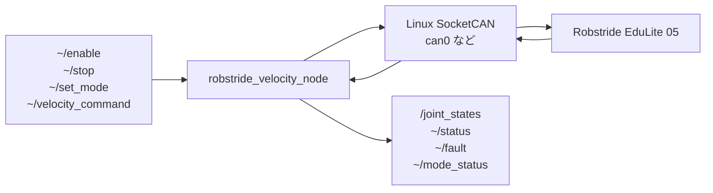

# robstride_can

RDKからSocketCANを使ってRobstride EduLite 05を動かすための実験用packageです。

このpackageはSTM向けのPWM CAN bridgeとは別物です。`can_msgs` topicには変換せず、nodeからLinux SocketCANへ直接writeします。

実際に動いた可能性がある `rodep-soft/el05_usb_can_driver` の設計に合わせ、Robstride EL05の **Private Protocol** を使います。MIT protocolではありません。

## 前提

- Robstride側がPrivate Protocolで動くこと
- CAN bitrateはRobstride EduLite 05のdefaultである1Mbpsに合わせること
- 最初は無負荷、低速、すぐ電源を切れる状態で確認すること

Private Protocolでは29-bit extended CAN IDを使います。速度モードでは、`run_mode` をvelocity modeにしてからenableし、`spd_ref` と `limit_cur` parameterを書きます。

## CAN interface設定例

RDK側でRobstrideにつながっているinterface名を確認します。

```bash
ip link show
```

`can0` を使う場合の設定例です。

```bash
sudo ip link set can0 down
sudo ip link set can0 type can bitrate 1000000
sudo ip link set can0 up
```

## 起動

```bash
ros2 launch robstride_can robstride_velocity.launch.py
```

configを変える場合:

```bash
ros2 launch robstride_can robstride_velocity.launch.py config_file:=/path/to/robstride_velocity.yaml
```

## 速度指令

まずvelocity modeへ切り替えてenableします。

```bash
ros2 topic pub --once /robstride_velocity_node/stop std_msgs/msg/Empty '{}'
ros2 topic pub --once /robstride_velocity_node/set_mode std_msgs/msg/UInt8 "{data: 2}"
ros2 topic pub --once /robstride_velocity_node/enable std_msgs/msg/Bool "{data: true}"
```

起動後に速度を変える場合:

```bash
ros2 topic pub /robstride_velocity_node/velocity_command std_msgs/msg/Float64MultiArray "{data: [0.5, 1.0]}" -1
```

停止させる場合:

```bash
ros2 topic pub --once /robstride_velocity_node/stop std_msgs/msg/Empty '{}'
```

node終了時にもstop commandを送る設定にしています。

## 入出力



### Subscribe

- `~/enable` (`std_msgs/msg/Bool`): `true` で enable、`false` で stop
- `~/stop` (`std_msgs/msg/Empty`): stop command を送る
- `~/set_mode` (`std_msgs/msg/UInt8`): `run_mode` parameter を書く。velocity mode は `2`
- `~/velocity_command` (`std_msgs/msg/Float64MultiArray`): `[speed_rad_s, current_limit_a]`

### Publish

- `~/status` (`std_msgs/msg/String`): feedbackをJSON風の文字列でpublish
- `~/fault` (`std_msgs/msg/UInt32`): fault bit
- `~/mode_status` (`std_msgs/msg/UInt8`): Robstrideから返るmode status
- `/joint_states` (`sensor_msgs/msg/JointState`): position、velocity、torque

## 主なparameter

- `can_interface`: 使用するSocketCAN interface。例: `can0`
- `motor_id`: Robstrideに設定されているmotor CAN ID
- `host_id`: Robstrideのstatus responseを受けるhost ID
- `joint_name`: `/joint_states` に出すjoint名
- `current_limit_a`: velocity modeの電流制限
- `auto_enable`: 起動時に stop、velocity mode設定、enable を送る
- `stop_on_shutdown`: node終了時に stop command を送る
- `position_min_rad` / `position_max_rad`: feedback位置の変換範囲
- `velocity_min_rad_s` / `velocity_max_rad_s`: feedback速度の変換範囲
- `torque_min_nm` / `torque_max_nm`: feedbackトルクの変換範囲

## 注意

RobstrideがMIT protocolに切り替わっている場合、このnodeのPrivate Protocol commandでは回りません。

実機で動かすときは、まず `candump can0` で29-bit extended frameが流れていることと、feedbackが返っていることを確認してください。
