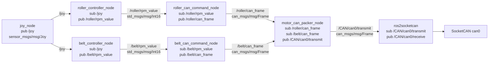
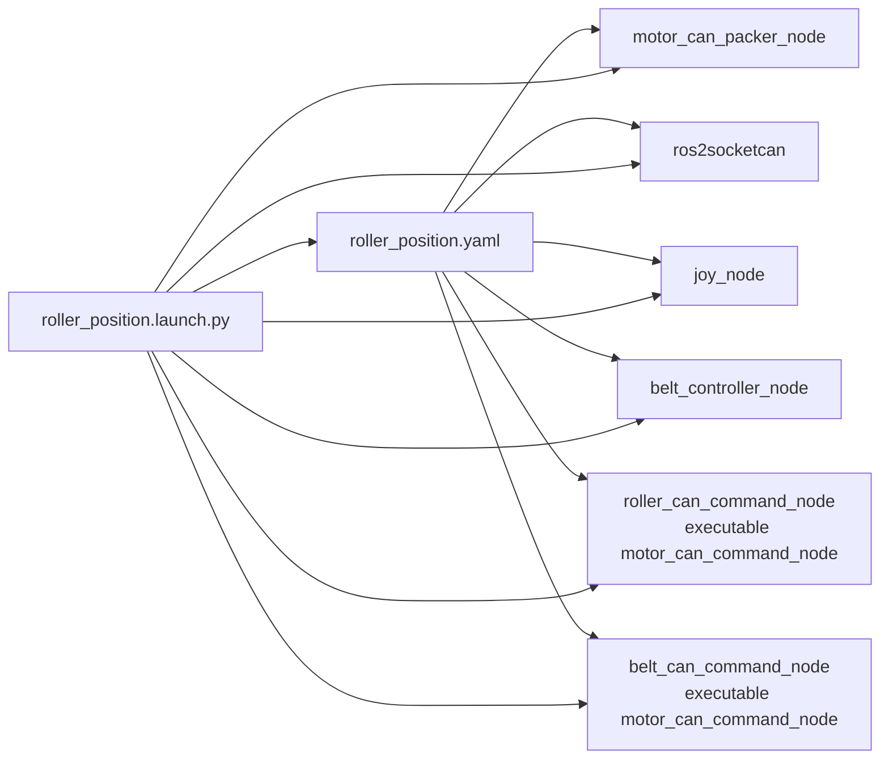
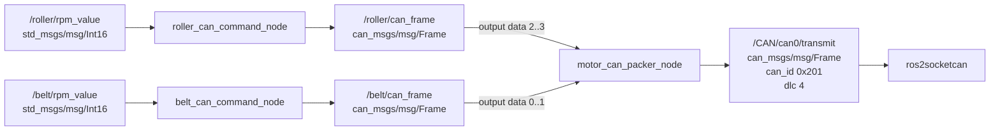
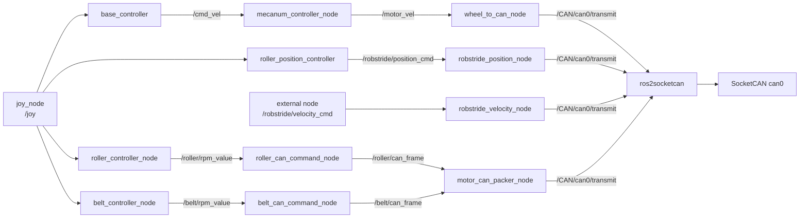

# ROS 2 Node / Topic Mermaid

対象: `ros2_ws/src`

ブランチ: `jodan/test_can_stm`

## 現在の主な流れ

## roller_position.launch.py の起動構成

## STM Roller / Belt Packer

## 全体の周辺系統

## 注意点

- `belt_controller_node` は `/belt/rpm_value` を publish するように変更済み。
- `belt_can_command_node` は `/belt/rpm_value` を subscribe するため、MAD motor のPWM値が belt 側CAN frameへつながる。
- `roller_controller_node` は `/roller/rpm_value` を publish する実装だが、`angle_motor` のCMakeにはまだ実行ファイル登録がない。
- `roller_position.launch.py` では `belt_controller_node` は起動するが、`roller_controller_node` は起動しない。
- `motor_can_packer_node` は有効な入力channelをすべて受け取るまで `/CAN/can0/transmit` にpublishしない。
