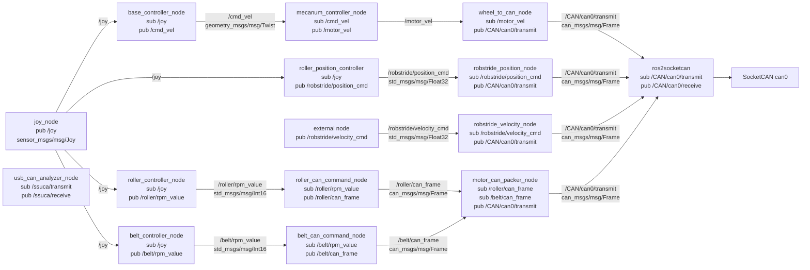
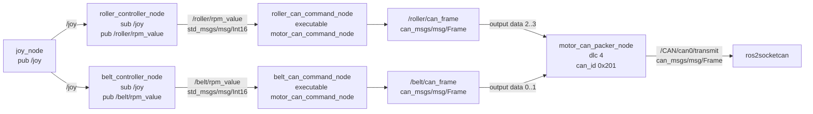
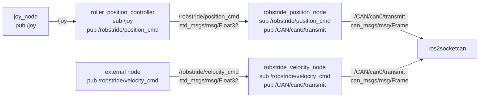
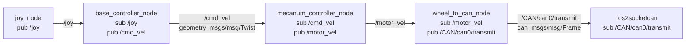

# ROS 2 Node / Topic Mermaid

対象: `ros2_ws/src`

ブランチ: `jodan/test_can_stm`

## 全体の node / topic

```mermaid
flowchart LR
  joy["joy_node<br/>pub /joy<br/>sensor_msgs/msg/Joy"]

  base["base_controller_node<br/>sub /joy<br/>pub /cmd_vel"]
  mecanum["mecanum_controller_node<br/>sub /cmd_vel<br/>pub /motor_vel"]
  wheel["wheel_to_can_node<br/>sub /motor_vel<br/>pub /CAN/can0/transmit"]

  roller_position["roller_position_controller<br/>sub /joy<br/>pub /robstride/position_cmd"]
  rob_pos["robstride_position_node<br/>sub /robstride/position_cmd<br/>pub /CAN/can0/transmit"]
  rob_vel_src["external node<br/>pub /robstride/velocity_cmd"]
  rob_vel["robstride_velocity_node<br/>sub /robstride/velocity_cmd<br/>pub /CAN/can0/transmit"]

  belt_controller["belt_controller_node<br/>sub /joy<br/>pub /belt/rpm_value"]
  roller_controller["roller_controller_node<br/>sub /joy<br/>pub /roller/rpm_value"]
  roller_cmd["roller_can_command_node<br/>sub /roller/rpm_value<br/>pub /roller/can_frame"]
  belt_cmd["belt_can_command_node<br/>sub /belt/rpm_value<br/>pub /belt/can_frame"]
  packer["motor_can_packer_node<br/>sub /roller/can_frame<br/>sub /belt/can_frame<br/>pub /CAN/can0/transmit"]

  socketcan["ros2socketcan<br/>sub /CAN/can0/transmit<br/>pub /CAN/can0/receive"]
  can0["SocketCAN can0"]
  usbcan["usb_can_analyzer_node<br/>sub /ssuca/transmit<br/>pub /ssuca/receive"]

  joy -->|/joy| base
  base -->|/cmd_vel<br/>geometry_msgs/msg/Twist| mecanum
  mecanum -->|/motor_vel| wheel
  wheel -->|/CAN/can0/transmit<br/>can_msgs/msg/Frame| socketcan

  joy -->|/joy| roller_position
  roller_position -->|/robstride/position_cmd<br/>std_msgs/msg/Float32| rob_pos
  rob_vel_src -->|/robstride/velocity_cmd<br/>std_msgs/msg/Float32| rob_vel
  rob_pos -->|/CAN/can0/transmit<br/>can_msgs/msg/Frame| socketcan
  rob_vel -->|/CAN/can0/transmit<br/>can_msgs/msg/Frame| socketcan

  joy -->|/joy| belt_controller
  joy -->|/joy| roller_controller
  belt_controller -->|/belt/rpm_value<br/>std_msgs/msg/Int16| belt_cmd
  roller_controller -->|/roller/rpm_value<br/>std_msgs/msg/Int16| roller_cmd
  roller_cmd -->|/roller/can_frame<br/>can_msgs/msg/Frame| packer
  belt_cmd -->|/belt/can_frame<br/>can_msgs/msg/Frame| packer
  packer -->|/CAN/can0/transmit<br/>can_msgs/msg/Frame| socketcan

  socketcan --> can0
```

## STM roller / belt

```mermaid
flowchart LR
  joy["joy_node<br/>pub /joy"]

  roller_ctrl["roller_controller_node<br/>sub /joy<br/>pub /roller/rpm_value"]
  belt_ctrl["belt_controller_node<br/>sub /joy<br/>pub /belt/rpm_value"]

  roller_cmd["roller_can_command_node<br/>executable motor_can_command_node"]
  belt_cmd["belt_can_command_node<br/>executable motor_can_command_node"]

  roller_frame["/roller/can_frame<br/>can_msgs/msg/Frame"]
  belt_frame["/belt/can_frame<br/>can_msgs/msg/Frame"]

  packer["motor_can_packer_node<br/>dlc 4<br/>can_id 0x201"]
  socketcan["ros2socketcan"]

  joy -->|/joy| roller_ctrl
  joy -->|/joy| belt_ctrl

  roller_ctrl -->|/roller/rpm_value<br/>std_msgs/msg/Int16| roller_cmd
  belt_ctrl -->|/belt/rpm_value<br/>std_msgs/msg/Int16| belt_cmd

  roller_cmd --> roller_frame
  belt_cmd --> belt_frame

  roller_frame -->|output data 2..3| packer
  belt_frame -->|output data 0..1| packer
  packer -->|/CAN/can0/transmit<br/>can_msgs/msg/Frame| socketcan
```

## RobStride

```mermaid
flowchart LR
  joy["joy_node<br/>pub /joy"]

  roller_position["roller_position_controller<br/>sub /joy<br/>pub /robstride/position_cmd"]
  rob_pos["robstride_position_node<br/>sub /robstride/position_cmd<br/>pub /CAN/can0/transmit"]
  rob_vel_src["external node<br/>pub /robstride/velocity_cmd"]
  rob_vel["robstride_velocity_node<br/>sub /robstride/velocity_cmd<br/>pub /CAN/can0/transmit"]
  socketcan["ros2socketcan"]

  joy -->|/joy| roller_position
  roller_position -->|/robstride/position_cmd<br/>std_msgs/msg/Float32| rob_pos
  rob_vel_src -->|/robstride/velocity_cmd<br/>std_msgs/msg/Float32| rob_vel
  rob_pos -->|/CAN/can0/transmit<br/>can_msgs/msg/Frame| socketcan
  rob_vel -->|/CAN/can0/transmit<br/>can_msgs/msg/Frame| socketcan
```

## 足回り

```mermaid
flowchart LR
  joy["joy_node<br/>pub /joy"]
  base["base_controller_node<br/>sub /joy<br/>pub /cmd_vel"]
  mecanum["mecanum_controller_node<br/>sub /cmd_vel<br/>pub /motor_vel"]
  wheel["wheel_to_can_node<br/>sub /motor_vel<br/>pub /CAN/can0/transmit"]
  socketcan["ros2socketcan<br/>sub /CAN/can0/transmit"]

  joy -->|/joy| base
  base -->|/cmd_vel<br/>geometry_msgs/msg/Twist| mecanum
  mecanum -->|/motor_vel| wheel
  wheel -->|/CAN/can0/transmit<br/>can_msgs/msg/Frame| socketcan
```
