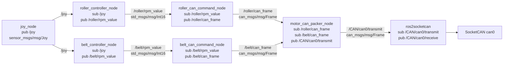
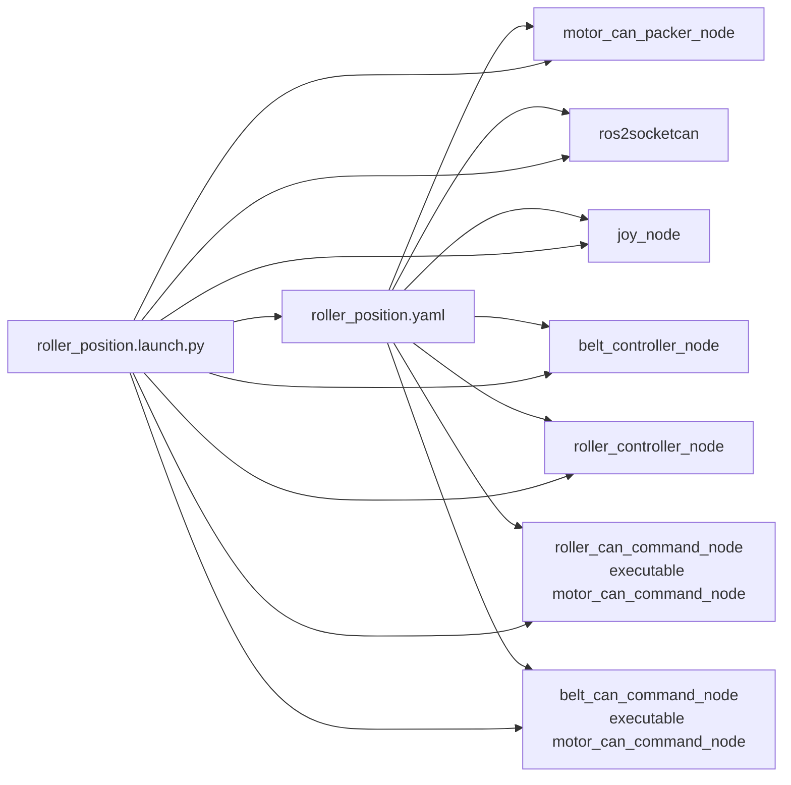
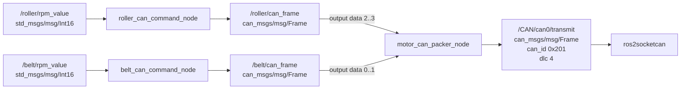
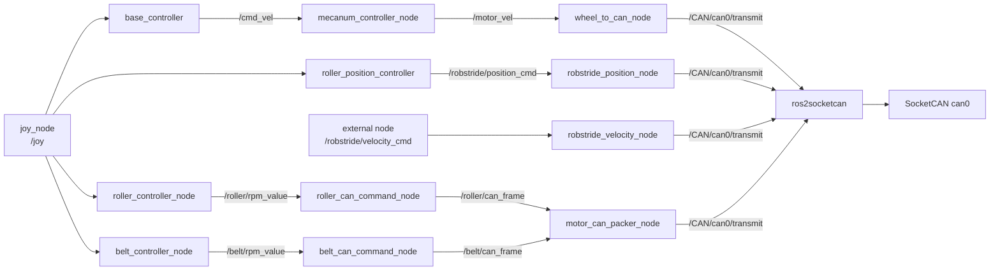
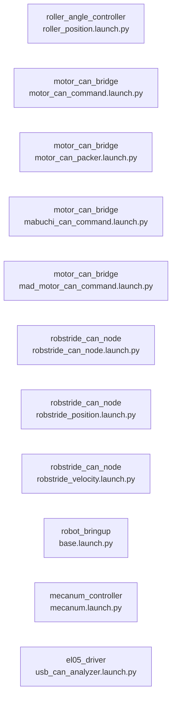
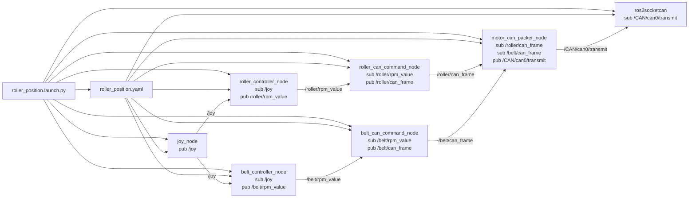
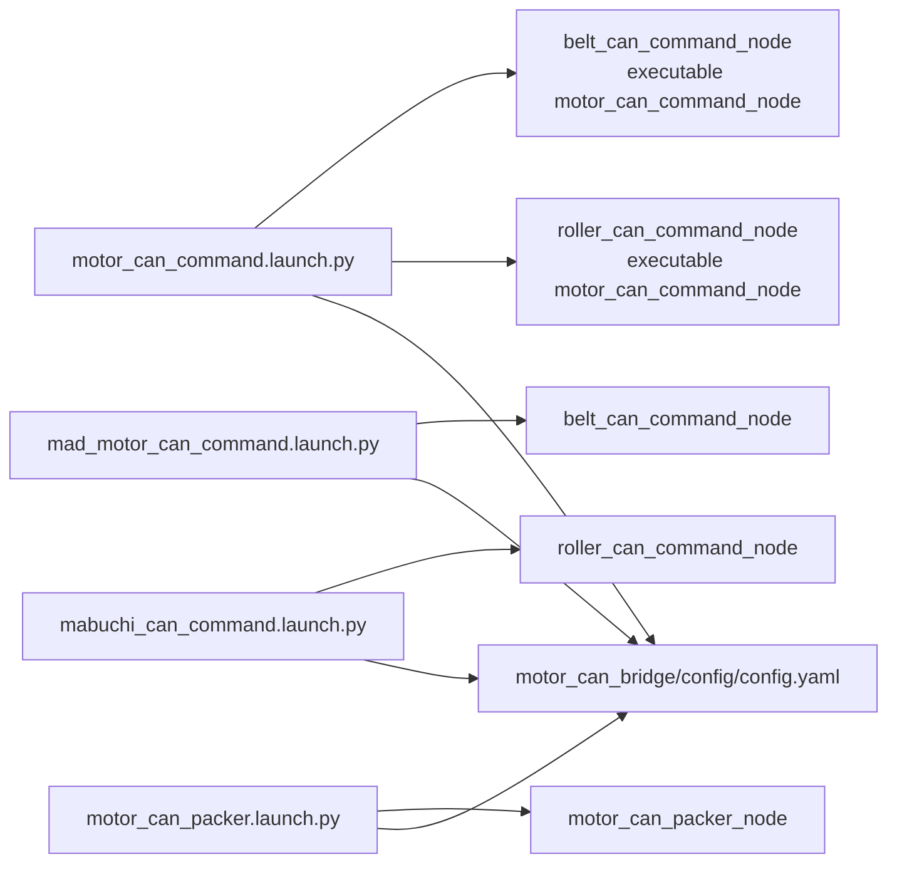
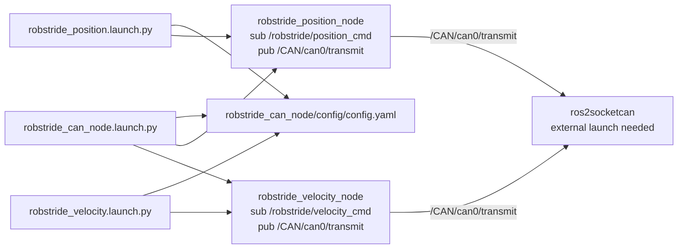
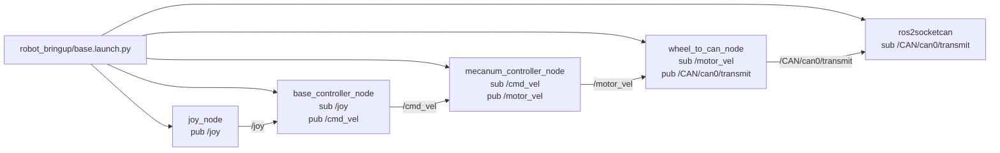
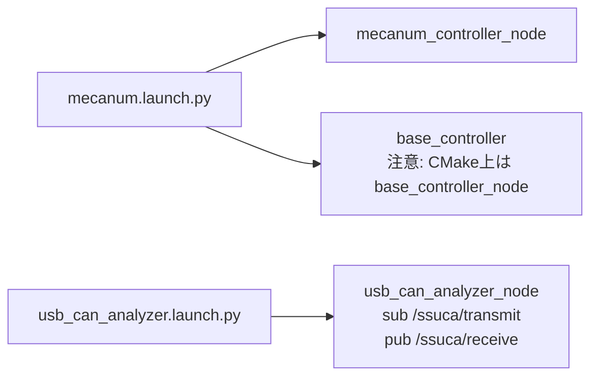

# ROS 2 Node / Topic Mermaid

対象: `ros2_ws/src`

ブランチ: `jodan/test_can_stm`

## 現在の主な流れ

## roller_position.launch.py の起動構成

## STM Roller / Belt Packer

## 全体の周辺系統

## Launch file 一覧

## roller_position.launch.py

現在の STM roller/belt 送信系をまとめて起動する launch。

## motor_can_bridge launch

## robstride_can_node launch

## robot_bringup/base.launch.py

足回り系をまとめて起動する launch。`wheel_to_can_node` は `TimerAction` で5秒遅延起動される。

## その他の launch

## 注意点

- `belt_controller_node` は `/belt/rpm_value` を publish するように変更済み。
- `belt_can_command_node` は `/belt/rpm_value` を subscribe するため、MAD motor のPWM値が belt 側CAN frameへつながる。
- `roller_controller_node` は `angle_motor` の実行ファイルとして登録済み。
- `roller_position.launch.py` では `belt_controller_node` と `roller_controller_node` の両方を起動する。
- `motor_can_packer_node` は有効な入力channelをすべて受け取るまで `/CAN/can0/transmit` にpublishしない。
- `mecanum_controller/launch/mecanum.launch.py` は `base_controller` を指定しているが、CMakeでinstallされる実行ファイルは `base_controller_node`。
